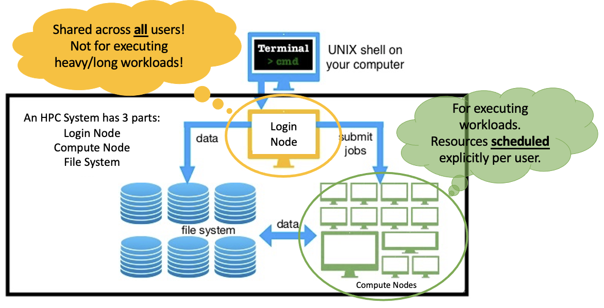

<!--
 t01_introduction_to_hpc_systems.md

 CaSToRC, The Cyprus Institute

 (c) 2024 The Cyprus Institute

 Contributing Authors:
 Christodoulos Stylianou (c.stylianou@cyi.ac.cy)
 Kyriaki Kylili (k.kylili@cyi.ac.cy)
 Spyroulla Mavrommati (s.mavrommati@cyi.ac.cy)
 
 Licensed under the Apache License, Version 2.0 (the "License");
 you may not use this file except in compliance with the License.
 You may obtain a copy of the License at
 
     https://www.apache.org/licenses/LICENSE-2.0
 
 Unless required by applicable law or agreed to in writing, software
 distributed under the License is distributed on an "AS IS" BASIS,
 WITHOUT WARRANTIES OR CONDITIONS OF ANY KIND, either express or implied.
 See the License for the specific language governing permissions and
 limitations under the License.
-->

# 1. Introduction to HPC Systems

## 1.1. Overview
<div style="text-align: justify;">
This tutorial provides a high-level introduction to High-Performance Computing (HPC) systems, with a focus on Cyclone's architecture and operational principles. Participants will explore the fundamental components of an HPC system, including compute nodes and file systems, while gaining insight into data management policies. Additionally, the tutorial introduces key concepts such as software management through modules, and job scheduling using SLURM, setting the stage for deeper exploration in subsequent tutorials.
</div>

---

## 1.2.	Learning Objectives
By the end of this tutorial, participants will be able to:
<div style="text-align: justify;">
<ol>
    <li>Describe the architecture of an HPC system, including Cyclone’s compute nodes and interconnects.</li>
    <li>Identify and understand the use cases of Cyclone’s file systems (home, scratch, shared directories).</li>
    <li>Identify when to use an HPC system or alternative solutions such as Cloud systems or High-end Workstations.</li>
    <li>Recognize the role of modules in managing software environments and how they simplify system use.</li>
    <li>Understand the purpose of job scheduling and the function of SLURM in resource management.</li>
</ol>
</div>

---

## 1.3. Overview of HPC Architectures
<!-- The tutorial begins by defining High-Performance Computing (HPC) and explaining its importance in solving complex computational problems. Participants will be introduced to Cyclone’s architecture, focusing on its key components: login nodes, compute nodes, and interconnects. Login nodes serve as the interface for users to prepare jobs and access the system, while compute nodes are the dedicated resources where jobs are executed. High-speed interconnects link the nodes, enabling efficient communication and parallel processing. A high-level explanation of how resources are shared among users provides context for understanding Cyclone’s operational principles. -->
<div style="text-align: justify;">
An HPC system is typically composed of multiple interconnected <b>compute nodes</b> which work in parallel to solve large-scale tasks. Each compute node consists of CPUs and GPUs (in some cases) designed for performing the computations. These nodes are interconnected through high-speed networks, which enable them to share data efficiently and work in parallel.
</div>



Key components of an HPC system:
<div style="text-align: justify;">
<ol>
    <li><b>Login Nodes:</b> These are the entry points for users to connect to the system. Users prepare their jobs, access resources, and manage data from the login nodes. However, compute jobs are not executed here.</li>
    <li><b>Compute Nodes:</b> These nodes execute user jobs. They often come with specialized hardware, like GPUs, to accelerate computational workloads.</li>
    <li><b>Interconnects:</b> These are high-speed networks that link the compute nodes together, ensuring fast data transfer between them. The interconnects are critical for achieving low latency and high bandwidth communication essential for parallel computing.</li>
    <li><b>Storage Systems:</b> These systems are used to manage the data. They include both <b>local storage</b> for temporary data and <b>shared storage</b> for datasets that are accessible across all nodes in the system, through the available filesystem.</li>
</ol>
The architecture ensures that large computational tasks are broken down into smaller sub-tasks, which are processed simultaneously across the nodes.
</div>

---

## 1.4. Overview of Cyclone
<div style="text-align: justify;">
Cyclone is the <b>National HPC system</b> hosted at <b>The Cyprus Institute</b>. It is designed to support a range of disciplines, including physics, climate modeling, bioinformatics, AI and more. Cyclone consists of login and compute nodes, high-speed interconnects and a file system to manage data storage across different types of files and directories.
</div>

### 1.4.1 Architecture Configuration
<div style="text-align: justify;">
<ol>
    <li><b>Compute Nodes:</b> 
    These are the main engines that run the jobs and computations. Cyclone has two types of compute nodes:
    <ul>
        <li><b>CPU Nodes:</b> There are 17 nodes, each with <b>40 cores</b>. These are used for general-purpose computing tasks like simulations, data processing, and more.
        </li>
        <li><b>GPU Nodes:</b> Cyclone has 16 nodes with <b>40 cores</b> and each node is also equipped with <b>4 NVIDIA V100 GPUs</b>. These specialized nodes are perfect for tasks that require faster computations, such as <b>deep learning</b> (AI), large-scale simulations, or tasks that benefit from the extra power of GPUs.
        </li>
    </ul>
    </li>
    <li><b>Node Details:</b>
    <ul>
        <li>Each node has <b>2 CPUs</b>, each with <b>20 cores</b> (so, 40 cores total). These CPUs are <b>Intel Xeon Gold 6248</b>, which are very powerful and efficient for handling parallel tasks.
        </li>
        <li>Each node also has <b>192 GB of memory</b> (RAM). This is where the data is temporarily stored and processed while jobs are running.
        </li>
    </ul>
    </li>
    <li><b>Storage:</b>
        <ul>
            <li>Cyclone has <b>135 TB of fast NVMe storage</b> for the <b>Scratch</b> and <b>Home</b> directories. These directories are used to store files and data that you’re working on during a job. The <b>Scratch</b> directory is for temporary files, and the <b>Home</b> directory is for your personal files and scripts.
            </li>
            <li>Additionally, there is <b>3.2 PB (Petabytes) of Shared Disk Storage</b>. This is a large space used for collaboration, allowing multiple users or teams to access and share project data.
            </li>
    </ul>
    </li>
    <li><b>Interconnect:</b> The system has an <b>HDR 100 Node-to-Node interconnect</b>, which is a high-speed network (up to 100GB/s) that allows nodes to communicate with each other very quickly. This is especially important for tasks that involve a lot of data moving between nodes, such as simulations and large data analysis.
    </li>
    <li><b>Operating System:</b> Cyclone uses <b>Rocky Linux 8.6</b>, an operating system that’s optimized for high-performance computing tasks.
    </li>
</ol>

This system is designed to support demanding tasks, like scientific simulations, machine learning, and data analysis, providing the necessary computing power, fast data transfer, and shared storage to store large datasets.
</div>

### 1.4.2. File System Overview 
<div style="text-align: justify;">
When working on Cyclone, your files will be stored in specific directories tailored to different purposes. Each directory has unique performance characteristics and retention policies. It is important to note that <b>no backups are performed on any of these directories</b>—it is solely the user's responsibility to maintain their own backups.
</div>

| **Directory**   | **Home Directory**                                                                                                                                                                                     | **Scratch Directory**                                                                                                                                                                                                                    | **Shared Data Directory**                                                                                                                                               |
| --------------- | ------------------------------------------------------------------------------------------------------------------------------------------------------------------------------------------------------ | ---------------------------------------------------------------------------------------------------------------------------------------------------------------------------------------------------------------------------------------- | ----------------------------------------------------------------------------------------------------------------------------------------------------------------------- |
| **Path**        | `/nvme/h/your_username/`                                                                                                                                                                               | `/nvme/scratch/your_username/`                                                                                                                                                                                                           | `/onyx/data/project_name/`                                                                                                                                              |
| **Description** | Personal space on Cyclone for storing configuration files, scripts, and small, critical files.                                                                                                         | High-performance, temporary storage for active computations and intermediate files.                                                                                                                                                      | Shared project directory available to multiple users for collaborative datasets or resources.                                                                           |
| **Performance** | Moderate I/O performance.                                                                                                                                                                              | High I/O performance optimized for compute-intensive workloads.                                                                                                                                                                          | Moderate to low I/O performance.                                                                                                                                        |
| **Retention**   | Persistent storage with no automatic cleanup, but limited in size. Monitor usage to avoid exceeding your quota.                                                                                        | Temporary storage. Files may be deleted after a set period or when the system requires space.                                                                                                                                            | Persistent storage, but subject to project-specific quotas and policies.                                                                                                |
| **Usage Tips**  | - Store SSH keys, environment setup files, and small codebases. <br> - Avoid storing large datasets or temporary files here. <br> - The home path can also be displayed by using the `$HOME` variable. | - Use for large datasets or files generated during computations. <br> - Regularly move important results to your home directory or a local backup to prevent data loss. <br> - The user Scratch path can also be located at `~/scratch`. | - Collaborate with team members by storing shared input data and results. <br> - Ensure file organization and naming conventions are clear for effective collaboration. |

### 1.4.4. Important Notes and Best Practises
<div style="text-align: justify;">
<ul>
<li><b>No Backups:</b> None of these directories are backed up by Cyclone. You must regularly back up your important data to a secure location.
</li>
<li><b>Data Responsibility:</b> It is the user's sole responsibility to maintain copies of critical files. Loss of data in these directories due to system failure or cleanup policies is irreversible.
</li>
<li>Store active job data in the <b>Scratch</b> directory.</li>
<li>Keep your source code and executables in the <b>Home</b> directory.</li>
<li>Store large shared data in <b>Shared</b> directories for collaboration.</li>
<li>Always back up important results from the <b>Scratch</b> directory to the <b>Home</b> or external storage to avoid data loss.</li>
</ul>
</div>

---

## 1.5. HPC Systems vs Cloud Systems vs High-End Workstations

Both <b>HPC systems</b>, <b>cloud platforms</b>, and <b>high-end workstations</b> offer powerful computational resources but are optimized for different tasks and use cases. Here's a comparison to help understand which system is more suitable for specific applications:

| **Feature**             | **HPC Systems**                                                                                                                                                                                                                   | **Cloud Systems**                                                                                                 | **High-End Workstations**                                                                                                                |
| ----------------------- | --------------------------------------------------------------------------------------------------------------------------------------------------------------------------------------------------------------------------------- | ----------------------------------------------------------------------------------------------------------------- | ---------------------------------------------------------------------------------------------------------------------------------------- |
| **Purpose**             | Optimized for large-scale, parallel, and intensive computations like simulations, AI, and complex calculations.                                                                                                                   | Designed for scalability and flexibility, best for small-scale tasks, web applications, or quick scalability.     | Suitable for single-machine tasks like 3D rendering, video editing, and software development, where extreme parallelism is not required. |
| **Hardware**            | Specialized CPUs, GPUs, and high-speed interconnects optimized for performance.                                                                                                                                                   | General-purpose hardware, flexible virtual machines, varying capabilities.                                        | Single high-performance CPU and GPU, moderate memory capacity (64GB to 128GB), optimized for individual tasks.                           |
| **Resource Allocation** | Fixed, controlled environment with job schedulers like SLURM to allocate resources efficiently.                                                                                                                                   | On-demand, pay-as-you-go provisioning with flexible scaling.                                                      | Limited scalability, bound by local hardware limitations.                                                                                |
| **When to Use**         | Ideal for large-scale simulations (climate modeling, molecular dynamics), intensive data processing (genomics, weather prediction), or AI tasks requiring parallel computing (large scale training, hyperparameter optimisation). | Best for web applications, small to medium workloads, or cost-effective solutions for short-term or ad-hoc tasks. | Best for personal or small-team use, with high power needed for design, simulations, or smaller AI workloads.                            |


---

## 1.6. Introduction to Modules
<div style="text-align: justify;">
In a High-Performance Computing (HPC) system like Cyclone, users often need to work with specialized software and libraries that are required for their research or computational tasks. <b>Modules</b> help manage these software environments in a way that simplifies the process and ensures compatibility across different users and applications.
</div>

### 1.6.1. What are Modules?
<div style="text-align: justify;">
A <b>module</b> is a tool that allows users to dynamically load, unload, and switch between different software environments without having to manually configure system paths or dependencies. Modules are used to make software easier to access on an HPC system, so you don’t need to worry about installation or environment conflicts.

For example, when you want to use a specific version of Python, you can load the Python module for that version, and the system will automatically configure the necessary settings for you.
</div>

### 1.6.2. Why Use Modules?
<div style="text-align: justify;">
Using modules has several key benefits:
<ul>
    <li><b>No Root Access:</b> On HPC Systems, users do not have administrative priviledges in order to be able to install software in the same way as in traditional Linux systems (e.g., using <code class="language-bash">sudo apt-get</code>).</li>
    <li><b>Simplifies Environment Management:</b> You don’t need to worry about setting up complicated software environments. The system automatically adjusts paths and settings when you load a module.</li>
    <li><b>Prevents Software Conflicts:</b> Many HPC systems, including Cyclone, host multiple versions of software. Modules ensure that you can use the right version for your task without causing conflicts with other users.</li>
    <li><b>Saves Time:</b> Instead of manually installing or configuring software, you can simply load the required module and begin working right away.</li>
    <li><b>Ensures Reproducibility:</b> By using modules, you ensure that your environment is consistent across different sessions and that your work can be replicated by others.</li>
</ul>
</div>

### 1.6.3. How Modules Work
<div style="text-align: justify;">
Modules work by modifying the environment variables (like <code class="language-bash">PATH</code>, <code class="language-bash">LD_LIBRARY_PATH</code>, and others) to point to the correct version of the software. These environment variables tell the system where to find executables, libraries, and other resources required for the software to run properly.

For example, if you load the <b>Python 3.10</b> module, the system will automatically adjust the environment to use the <b>Python 3.10</b> binary and related libraries without affecting other users who may be using a different version of Python.
</div>

### 1.6.4. Common Module Commands Cheat Sheet
<div style="text-align: justify;">
Below is a table summarizing some of the most commonly used module commands to manage your software environment on Cyclone.
</div>

| **Command**                | **Description**                                                                | **Example**                               |
| -------------------------- | ------------------------------------------------------------------------------ | ----------------------------------------- |
| **List Available Modules** | View all available software modules.                                           | `module avail`                            |
| **Load a Module**          | Load a specific module to set up the software environment.                     | `module load Python/3.8.5`                |
| **Unload a Module**        | Unload a currently loaded module when it is no longer needed.                  | `module unload Python/3.8.5`              |
| **Check Loaded Modules**   | View a list of all currently loaded modules in your environment.               | `module list`                             |
| **Switch Between Modules** | Switch from one version of a module to another (e.g., switch Python versions). | `module switch Python/3.8.5 Python/3.9.1` |

---

## 1.7. Introduction to Job Scheduling and SLURM 
<div style="text-align: justify;">
In systems like Cyclone, multiple users often share the same resources (e.g., CPUs, memory, GPUs). To ensure that everyone gets <b>fair access</b> to the system’s resources, HPC systems use <b>job scheduling</b>. <b>SLURM</b> (<i>Simple Linux Utility for Resource Management</i>) is the job scheduler used on Cyclone to manage and allocate resources for running computational tasks.
</div>

### 1.7.1. What is Job Scheduling?
<div style="text-align: justify;">
Job scheduling is a process where the system manages the allocation of computational resources for running tasks (jobs). Instead of users running tasks directly on the system, SLURM queues up jobs, decides when and where they should run, and allocates resources such as CPUs, memory, and GPUs to those jobs.

This is especially important in a multi-user environment like Cyclone, where many tasks might need to run at the same time. SLURM helps manage and prioritize these tasks, ensuring that resources are used efficiently and fairly.
</div>

### 1.7.2. Why is Job Scheduling Important?
<div style="text-align: justify;">
Job scheduling is important because:
<ul>
    <li><b>Fair Resource Allocation:</b> It ensures that <b>no single user monopolizes the system</b> and that resources are shared equitably among all users.</li>
    <li><b>Efficient Use of Resources:</b> SLURM makes sure that the system’s resources are used optimally, by deciding the best time and place to run each job.</li>
    <li><b>Queue Management:</b> SLURM organizes jobs into queues and allows jobs to wait in line until resources become available.</li>
</ul>
</div>

### 1.7.3. How Does SLURM Work?
<div style="text-align: justify;">
SLURM divides resources into <b>partitions</b> (<i>groups of compute nodes</i>) based on their hardware and intended use. A user submits a job request, and SLURM assigns the job to the most appropriate node, based on the job’s resource requirements (e.g., number of cores, memory, GPU).

SLURM provides several commands to interact with the job scheduler and manage jobs. Below are the key SLURM commands that you will use to submit and manage jobs.
</div>

### 1.7.4. Key SLURM Commands Cheat Sheet
| **Category**           | **Command**                      | **Description**                                                           |
| ---------------------- | -------------------------------- | ------------------------------------------------------------------------- |
| **Job Submission**     | `sbatch <script>`                | Submit a job using a submission script.                                   |
| **Cancel Job**         | `scancel <job_id>`               | Cancel a specific job using its job ID.                                   |
| **Hold Job**           | `scontrol hold <job_id>`         | Place a job on hold, preventing it from starting.                         |
| **Release Job**        | `scontrol release <job_id>`      | Release a held job, allowing it to start when resources become available. |
| **Queue Overview**     | `squeue`                         | View the status of all jobs in the queue.                                 |
| **My Queued Jobs**     | `squeue -u <your_username>`      | View jobs specific to your user account.                                  |
| **Detailed Job Info**  | `scontrol show job <job_id>`     | Show detailed information about a specific job.                           |
| **Job History**        | `sacct -j <job_id>`              | View historical job statistics and performance for a specific job.        |
| **Partition Info**     | `sinfo`                          | View available partitions, their nodes, and current states.               |
| **Node Details**       | `sinfo -N`                       | Display detailed node information for all partitions.                     |
| **Resources Per Node** | `scontrol show node <node_name>` | Display detailed resource availability for a specific node.               |

### 1.7.5. Job Status Symbols
SLURM uses the following symbols to indicate the current state of a job:

| **Symbol** | **Status**   | **Description**                                                   |
| ---------- | ------------ | ----------------------------------------------------------------- |
| `PD`       | Pending      | Job is waiting for resources or dependencies to become available. |
| `R`        | Running      | Job is currently executing.                                       |
| `CG`       | Completing   | Job is completing, cleaning up resources.                         |
| `CF`       | Configuring  | Job is configuring, setting up resources.                         |
| `CD`       | Completed    | Job has finished successfully.                                    |
| `F`        | Failed       | Job failed to execute successfully.                               |
| `TO`       | Timeout      | Job exceeded the allocated time limit.                            |
| `CA`       | Canceled     | Job was canceled by the user or administrator.                    |
| `NF`       | Node Failure | Job failed due to a node failure.                                 |
| `ST`       | Stopped      | Job has been stopped.                                             |

### 1.7.6. Submitting a Job with `sbatch`
<div style="text-align: justify;">
To submit a job to SLURM, you will typically create a <b>job script</b> (a text file with the required commands) and submit it using the <code class="language-bash">sbatch</code> command. The job script defines the resources your job needs (such as the number of CPUs, memory, and time), along with the command to run your application.
</div>

#### Example Job Script <code>my_job_script.sh</code>:
```bash
#!/bin/bash
#SBATCH --job-name=my_job
#SBATCH --output=output.txt
#SBATCH --error=error.txt
#SBATCH --time=01:00:00  # Set the maximum runtime (hh:mm:ss)
#SBATCH --ntasks=1        # Number of tasks (CPUs) to run
#SBATCH --mem=4G          # Memory required for the job
#SBATCH --partition=cpu   # Which partition to run the job on

# Your command(s) to run the job 
# e.g., a Python script or an executable
python my_script.py
```

<div style="text-align: justify;">
In this script:
<ul>
    <li><code>#SBATCH</code> lines are SLURM directives that <b>define resource requirements</b>.
    <li>After defining the resources, the script contains the command to run the job, in this case, a Python script (<code>python my_script.py</code>). Note that instead of a single command, it could have been a series of commands.</li>
</ul>
</div>

<div style="text-align: justify;">
Once the job script is ready, you can submit it with the following command:
</div>

<div class="box">
<pre>
<code class="language-bash">
sbatch my_job_script.sh
</code>
</pre>
</div>

### 1.7.6. Monitoring Jobs
<div style="text-align: justify;">
Monitoring your jobs on Cyclone is essential to ensure they are running smoothly. Use the <code>squeue</code> command to check the status of your active jobs, including information such as job ID, partition, and node allocation. If a job needs to be canceled, you can use the <code>scancel</code> command with the job ID. Once a job completes, the <code>sacct</code> command allows you to view detailed statistics, such as resource usage and job duration.
</div>

#### Checking Job Status
Use `squeue` to view active jobs:
```bash
squeue -u <your_username>
```
Output example:
```
JOBID   PARTITION   NAME      USER   ST   TIME    NODES   NODELIST(REASON)
12345   cpu         test_job  user1  R    00:05:12   1      cn01
```

#### Canceling Jobs
Cancel a running or queued job:
```bash
scancel <job_id>
```

#### Viewing Completed Jobs
Use `sacct` to see statistics of completed jobs:
```bash
sacct -j <job_id>
```

### 1.7.7. Resource Allocation 

When using an HPC system like Cyclone, it’s crucial to request the right resources to run your jobs efficiently and avoid wasting system capacity. Below useful specifications and best practises are described.
</b>

#### Useful Specifications

| **Resource**     | **Description**                              | **Job Specification** |
| ---------------- | -------------------------------------------- | --------------------- |
| Nodes            | Number of Nodes                              | `--nodes`             |
| CPU tasks        | Number of CPU tasks per node                 | `--ntasks-per-node`   |
| CPU threads      | Number of CPU threads (cores) per task       | `--cpus-per-task`     |
| Memory           | Amount of RAM per Job                        | `--mem`               |
| GPUs             | Request for GPUs if needed                   | `--gres`              |
| System Partition | Either use the CPU or GPU part of the system | `--partition`         |

<br>


#### Best Practices 

<ol>
    <li><b>Request Only What You Need:</b> Avoid over-requesting resources. Only ask for the CPU cores, memory, and time your job actually needs.</li>
    <li><b>Use the Appropriate Partition:</b> Submit jobs to the correct partition (e.g., <b>CPU</b> for general tasks, <b>GPU</b> for tasks requiring GPU acceleration).</li>
    <li><b>Specify the Right Number of Cores:</b> Match the number of CPU cores to the needs of your job (e.g., single-core for small tasks, multi-core for parallel tasks).</li>
    <li><b>Limit Job Runtime:</b> Set a realistic time limit to prevent wasting resources. Avoid setting excessive or very short time limits.</li>
    <li><b>Use Job Arrays for Multiple Jobs:</b> For repetitive tasks (e.g., simulations), use job arrays to submit many jobs efficiently.</li>
    <li><b>Avoid Overloading the System:</b> Be mindful of the system load and avoid excessive resource requests, especially during peak usage times.</li>
    <li><b>Monitor Job Performance:</b> Use commands like <code>squeue</code> and <code>sacct</code> to check job status and resource usage.</li>
    <li><b>Use Interactive Jobs for Debugging:</b> For testing and debugging, run jobs interactively to better understand and optimize resource requirements. <b>Don't run on the login nodes of the system.</b></li>
</ol>

---

## 1.8. Useful Resources

<ul>
<li><a href="../utils/ENG_BPG_SLURM_V3_NCC-SPAIN-.pdf">SLURM Best Practises Guide:</a>This guide, created by <a href="https://eurocc-spain.res.es">EuroCC Spain</a>, provides comprehensive information on using SLURM. It covers essential topics such as resource allocation, job initiation, and monitoring. The document highlights best practices for memory management, efficient parallelism, and handling large numbers of jobs. Tips on managing job arrays, wall time, and CPU usage are also included to ensure optimized performance. This guide is particularly valuable for users working with SLURM in high-performance computing environments, offering practical advice on system usage and resource allocation.</li>
<li><a href="../utils/High-Performance-Computing_-WhyHow.pdf">High-Performance Computing - Why & How:</a> This document serves as an introduction to high-performance computing (HPC), explaining its relevance for research and computational tasks. It details the importance of HPC systems in fields like AI, data-intensive research, and simulations. The guide also emphasizes the need for proper training and access to systems like Cyclone at the Cyprus Institute. It provides an overview of various HPC resources, software, and how they enable more efficient and scalable computations. This guide is an excellent resource for those looking to understand HPC's capabilities and practical applications in the Cypriot ecosystem.</li>
</ul>

---

## 1.9. Recap and Next Steps
<div style="text-align: justify;">
To conclude, this tutorial provided an overview of Cyclone's architecture, focusing on key components such as compute nodes, storage systems, and high-speed interconnects, as well as the role of file systems like <b>Home</b> <b>Scratch</b> and <b>Shared</b> directories. We also explored the importance of resource management using <b>SLURM</b>, including job scheduling, job submission, and monitoring, as well as the use of <b>modules</b> to manage software environments. 

With this foundational knowledge, you are now ready to proceed to the next tutorials, where you will gain hands-on experience on accessing the system, with job submission, resource allocation, and utilizing modules, which are crucial for efficient any HPC system, including Cyclone.
</div>

---