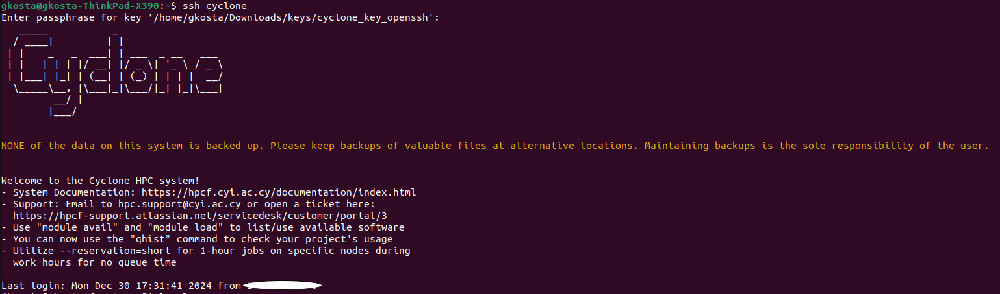
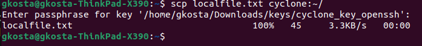
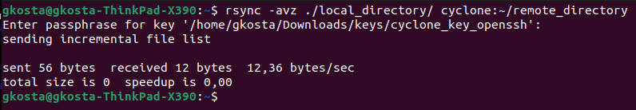
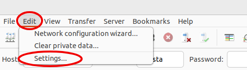
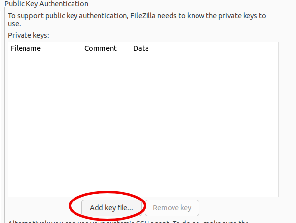
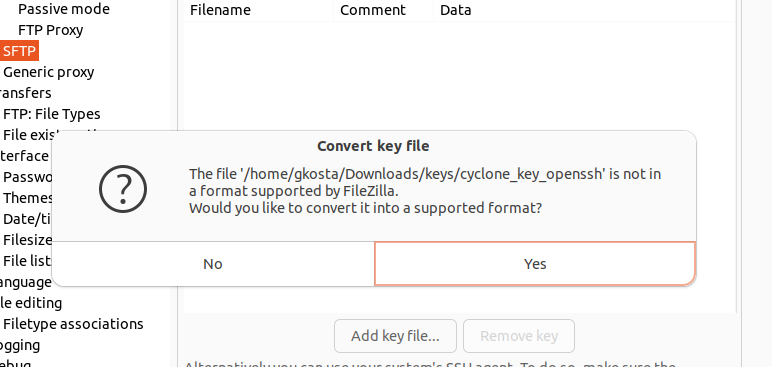
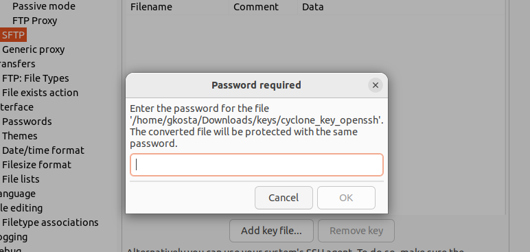
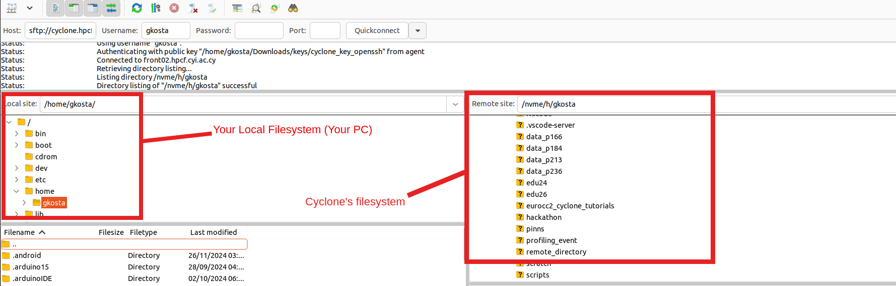

<!--
 t02_accessing_and_navigating_cyclone.md

 CaSToRC, The Cyprus Institute

 (c) 2024 The Cyprus Institute

 Contributing Authors:
 Giorgos Kosta (g.kosta@cyi.ac.cy)
 Emmanouil Kritikos (e.kritikos@cyi.ac.cy)
 Leonidas Christodoulou (l.christodoulou@cyi.ac.cy)
 
 Licensed under the Apache License, Version 2.0 (the "License");
 you may not use this file except in compliance with the License.
 You may obtain a copy of the License at
 
     https://www.apache.org/licenses/LICENSE-2.0
 
 Unless required by applicable law or agreed to in writing, software
 distributed under the License is distributed on an "AS IS" BASIS,
 WITHOUT WARRANTIES OR CONDITIONS OF ANY KIND, either express or implied.
 See the License for the specific language governing permissions and
 limitations under the License.
-->

# 2. Accessing and Navigating Cyclone

## 2.1. Overview
This tutorial provides a comprehensive guide for accessing and effectively using the Cyclone HPC system. You'll learn how to:

- Set up and manage SSH keys for secure access
- Connect securely to Cyclone from different operating systems
- Transfer files between your local machine and Cyclone
- Navigate the system using essential Linux commands
- Manage data across Cyclone's different storage areas

## 2.2. Prerequisites
- A Cyclone account (contact your system administrator if you don't have one)
- A computer with internet connection
- Administrator rights or permission to install software (for some setup options)

---

## 2.3. Getting Started

### 2.3.1. For MacOS and Linux Users

1. Open the Terminal application
   - On MacOS: Use Spotlight (Command + Space) and type "Terminal"
   - On Linux: Use your system's application launcher and search for "Terminal"
   - Keep this Terminal window open throughout the setup process

### 2.3.2. For Windows Users

1. Choose your terminal:
   - If using PowerShell: Search for "PowerShell" in the Start menu and run as Administrator
   - If using Git Bash (recommended): Launch Git Bash from the Start menu

## 2.4. Setting Up SSH and your keys

> Remember to replace `username` with your actual Cyclone username in all examples.

### 2.4.1. MacOS and Linux

Using SSH keys is more secure and convenient than password authentication. Here's how to set them up:

#### Managing SSH Keys

1. Start the SSH agent:

```bash
eval "$(ssh-agent -s)"
```

2. Add your SSH key to the agent:

> If you used another filename or directory to store your ssh key you generated, make sure to change it

```bash
ssh-add ~/.ssh/id_rsa
```


#### SSH Config File Setup

1. Navigate to your SSH directory:

```bash
cd ~/.ssh/
```

2. To simplify connections create or edit `~/.ssh/config` with nano:

```bash
nano config
```

3. In the nano editor, add these lines:

```bash
Host cyclone
    HostName cyclone.hpcf.cyi.ac.cy
    User your_username
    IdentityFile ~/.ssh/id_rsa
```

4. If you're using macOS, add this to your `~/.ssh/config` file to make the key persistent:

```bash
Host *
  UseKeychain yes
  AddKeysToAgent yes
  IdentityFile ~/.ssh/id_rsa
```

5. Save the file:

- Press Ctrl + X
- Press Y to confirm
- Press Enter to save

6. Return to your Terminal window to test the connection:

```bash
ssh cyclone
```

---

### 2.4.2. Windows

#### Option 1: Using PowerShell

##### 1. Start the SSH Agent

1. Open PowerShell as Administrator
2. Check if the SSH agent service is running:

```powershell
Get-Service ssh-agent
```

3. If the service is stopped, enable and start it:

```powershell
# Set the service to manual startup
Set-Service ssh-agent -StartupType Manual

# Start the service
Start-Service ssh-agent
```

##### 2. Add Your SSH Key

1. Add your private key to the SSH agent:

```powershell
ssh-add $env:USERPROFILE\.ssh\id_rsa
```

2. Verify the key was added:

```powershell
ssh-add -l
```

##### 3. Connect to Cyclone

```powershell
ssh username@cyclone.hpcf.cyi.ac.cy
```

Replace `username` with your Cyclone username

#### Option 2: Using Git Bash (Recommended)

> Using git bash doesn't require administrator permissions. Therefore this option will work even if Administrator restrictions apply on your computer.

##### 1. Start Git Bash

- Download Git Bash from https://git-scm.com/downloads
- Install Git Bash accepting the default options
- Open Git Bash from your start menu


##### 2. Add Your SSH Key

```bash
ssh-add ~/.ssh/id_rsa
```

##### 3. Create SSH Config (Optional but Recommended)

1. Create or edit `~/.ssh/config`:
```bash
nano ~/.ssh/config
```

2. Add these lines:

> Replace `your_username` with your Cyclone username

```bash
Host cyclone
    HostName cyclone.hpcf.cyi.ac.cy
    User your_username
    IdentityFile ~/.ssh/id_rsa
```

3. Save and close the file (Ctrl+X, then Y, then Enter)

##### 4. Connect to Cyclone

If using SSH config:
```bash
ssh cyclone
```

Without SSH config:
```bash
ssh username@cyclone.hpcf.cyi.ac.cy
```

When you successfully ssh/login, you'll be greeted with this message:



> If you are having trouble ssh/logging, refer to the troubleshooting steps at the end or try again the process from the beginning. 

## 2.5. Managing Data and Directories on Cyclone:


### 2.5.1. Home Directory Structure

When you log in, your home directory (`/nvme/h/<username>`) typically contains:

```bash
# Project data links
data_p166/  -> /onyx/data/p166    # Shared project storage
data_p184/  -> /onyx/data/p184    # Another project
data_p213/  -> /onyx/data/p213    # And so on...

# Scratch space link
scratch/    -> /nvme/scratch/<username>  # Personal scratch space

# Scratch space link for event
edu26/    -> /nvme/scratch/edu26  # Shared scratch space for events
```

> While these project directories (like `data_p166/`) will appear to be in your home directory, they are actually symbolic links (shortcuts) pointing to their real location on the `/onyx/data/` storage system. This is why you'll see them listed when you run `ls` in your home directory, even though they're physically stored elsewhere.

To see the contents of your own directory you can use the `ls` command when you login:

```bash
ls -a   # prints all files/directories, including hidden ones

ls -l   # prints visible directories in a list including important information like ownership, permissions, last date of modification

ls -la  # you can combine flags, this creates a list with all files/directories
```

To see your current working directory:

```bash
pwd
```

### 2.5.2. Storage Systems

#### Home Directory (`/nvme/h/<username>`)

- **Purpose**: Personal persistent storage

- **Features**:

    - Limited capacity
    - Backed up regularly
    - Contains symbolic links to project spaces

- **Best for**:

    - Scripts and source code
    - Configuration files
    - Small, important files
    - Symbolic links organization

#### Project Directories (`/onyx/data/p<XXX>`)

- **Purpose**: Shared project storage

- **Accessed via**: `~/data_p<XXX>` symbolic links

- **Features**:

    - Shared among project members
    - Larger capacity
    - Persistent storage

- **Best for**:

    - Shared datasets
    - Project results
    - Collaborative work
    - Long-term storage

#### Scratch Space (`/nvme/scratch/<username>`)

- **Purpose**: High-speed temporary storage

- **Accessed via**: `~/scratch` symbolic link

- **Features**:

    - High-performance I/O
    - Temporary storage
    - Files deleted after retention period

- **Best for**:
    - Active job data
    - Temporary files
    - Performance-critical operations

### 2.5.3. Directory Organization Best Practices

#### Project Data Organization

```bash
# In your project directory (e.g., ~/data_p166/)
data_p166/
├── datasets/           # Shared input data
├── results/           # Project results
│   ├── experiment1/
│   └── experiment2/
└── shared_scripts/    # Project-specific scripts

# In your scratch space
scratch/
├── job_outputs/      # Temporary job results
├── temp_data/       # Temporary processing
└── checkpoints/     # Job checkpoints
```

#### Personal Organization

```bash
# In your home directory
scripts/              # Personal script collection
├── job_templates/    # Slurm job templates
├── analysis/         # Analysis scripts
└── utils/           # Utility scripts

```

> These directories aren't created by default, except the scratch and project specific parent directories

### 2.5.4. Data Management Best Practices

#### Project Data Workflow

##### Setting up a New Project Space

Using the `cd` command to change directories:

```bash
# Navigate to your project directory
cd ~/data_p166
```
> The `~/` we use in our commands points to the home directory  

 
<br>


Using the `mkdir` command to make a directory. 

```bash
# Create standard project structure
mkdir -p datasets           # For input data
mkdir -p results            # For processed results
mkdir -p shared_scripts     # For project-specific scripts
mkdir -p documentation      # For project documentation
```

> The `-p` makes sure that any parent directories that don't already exist are created.

##### Working with Project Data

```bash
# Create a workspace in scratch for processing
mkdir -p ~/scratch/myanalysis
cd ~/scratch/myanalysis

# Copy input data to scratch for processing
cp ~/data_p166/datasets/input.dat ./

# After processing is complete, save important results
cp -r ./results ~/data_p166/results/analysis_20240319

# Clean up scratch space
cd ~
rm -rf ~/scratch/myanalysis
```

#### Space Management

Using the `du` command to view storage usage

Monitor storage:

```bash
# Check project space usage
du -h /onyx/data/p166
```

> The `-h` flag makes the sizes 'human readable' meaning it's converting them from bytes to MB/GB/TB

```bash
# Check scratch usage
du -hs ~/scratch
```

> The `-s` flag summarizes the storage usage of the hole directory. So if you want file by file usage, remove `s`


#### Data Safety

- Keep important data in project directories
- Use scratch for temporary processing only
- Regularly clean scratch space
- Document data organization for team members


## 2.6. Best Practices Summary

1. **Project Organization**:

    - Keep project data organized in project directories
    - Use consistent structure across projects

2. **Data Management**:

    - Store shared data in project directories
    - Use scratch for temporary processing
    - Clean up scratch regularly
    - Document organization for team members

3. **Job Workflow**:

    - Read input from project directories
    - Process in scratch space
    - Save results back to project directories
    - Clean up scratch after job completion

4. **Collaboration**:

    - Use project directories for sharing
    - Maintain consistent directory structure
    - Document data organization
    - Communicate changes with team members

Remember that your project memberships determine both your compute resource allocation (via Slurm) and your access to shared storage spaces. Always specify the correct project ID in your Slurm jobs and organize your data accordingly.

## 2.7. Transferring Files

### 2.7.1. Before starting:

1. Open a terminal on your local machine (not on Cyclone)
2. Make sure you know:
    - The full path of the file/directory on your local machine
    - Where you want it to go on Cyclone (or vice versa)

3. All commands below should be run from your local machine's terminal

---

### 2.7.2. Using SCP (Secure Copy):

#### Transferring FROM your local machine TO Cyclone:

```bash
# Run this command on your local machine's terminal
scp /path/on/your/local/machine/localfile.txt cyclone:~/destination/on/cyclone/
```

#### Transferring FROM Cyclone TO your local machine:

```bash
# Run this command on your local machine's terminal
scp cyclone:~/path/on/cyclone/remotefile.txt /path/on/your/local/machine/
```

#### If you have not created an ssh config file, replace `cyclone` with `username@cyclone.hpcf.cyi.ac.cy`


<br>

#### This is what it should look like:



### 2.7.3. Using Rsync (Recommended for Large Transfers)
#### Copying FROM your local machine TO Cyclone:

```bash
# Run this on your local machine's terminal
# The ./ refers to the current directory on your local machine
rsync -avz ./local_directory/ cyclone:~/remote_directory/
```



#### Copying FROM Cyclone TO your local machine:

```bash 
# Run this on your local machine's terminal
rsync -avz cyclone:~/remote_directory/ ./local_directory/
```

> 💡 Note: All file transfer commands should be run from your local machine's terminal, not from within Cyclone. The paths before the colon (\:) refer to your local machine, while paths after the colon refer to locations on Cyclone.

### 2.7.4. Using FileZilla (Graphical Interface)

1. Download and install FileZilla
2. Go to Edit → Settings 



3. Go to SFTP


4. Add your key



If your key is in openssh format, you'll be prompted to convert your key. Press yes:



Then input your passphrase:



And then save the converted key. It's a good idea to keep it at the same place as the original in case you go looking for it in the future.

5. Set up connection:
   - Host: sftp://cyclone.hpcf.cyi.ac.cy
   - Username: your_username
   - Port: 22
6. Quick connect



Once you're connected you'll see your local directory on the left and cyclone on the right. You can now just **drag and drop** between the two and the transfer wil happen automatically!

---


## 2.8. Security Best Practices

1. Use different keys for different services
2. Regularly rotate keys (yearly)
3. Always use strong passphrases
4. Back up your private keys securely
5. Never share private keys

## 2.9. Troubleshooting SSH (MacOS/Linux/Git Bash)

#### If you have ssh agend issues:
#### Set Up SSH Agent Automatically

1. Open or create the `~/.bashrc` file:

```bash
nano ~/.bashrc
```

2. Add these lines to the file:

```bash
# Start SSH agent if not running
if [ -z "$SSH_AUTH_SOCK" ] ; then
    eval `ssh-agent -s` > /dev/null
fi
```

3. Save and close the file (Ctrl+X, then Y, then Enter)
4. Reload the configuration:

```bash
source ~/.bashrc
```

#### If you have connection issues:

1. Check SSH agent:

```bash
ssh-add -l #This will list all of your added keys
```


2. Verify permissions:

```bash
chmod 700 ~/.ssh
chmod 600 ~/.ssh/id_rsa
chmod 644 ~/.ssh/id_rsa.pub
```

> This makes sure your private/public key and the directory they are in have the correct read write and execute permissions for the ssh client to allow a connection.

3. Test connection with verbose output:

```bash
ssh -v cyclone # Adding the `-v` flag prints debuging information 
```


## 2.10. Troubleshooting SSH (Powershell)

1. If your key doesn't have the correct permissions:

```powershell
icacls <path-to-your-id_rsa> /inheritance:r /grant:r "$($env:USERNAME):(F)"
```


Remember to replace `username` with your actual Cyclone username in all examples.


