<!--
 t03_setting_up_and_using_development_tools.md

 CaSToRC, The Cyprus Institute

 (c) 2024 The Cyprus Institute

 Contributing Authors:
 Marios Constantinou (mar.constantinou@cyi.ac.cy)
 Kyriaki Kylili (k.kylili@cyi.ac.cy)
 
 Licensed under the Apache License, Version 2.0 (the "License");
 you may not use this file except in compliance with the License.
 You may obtain a copy of the License at
 
     https://www.apache.org/licenses/LICENSE-2.0
 
 Unless required by applicable law or agreed to in writing, software
 distributed under the License is distributed on an "AS IS" BASIS,
 WITHOUT WARRANTIES OR CONDITIONS OF ANY KIND, either express or implied.
 See the License for the specific language governing permissions and
 limitations under the License.
-->

# 3. Setting up and Using Development Tools

## 3.1. Overview

<div style="text-align: justify; margin-bottom: 15px;">
This tutorial introduces users to modern development tools and workflows that simplify working on HPC systems like Cyclone. Participants will learn to set up and configure tools like VS Code and MobaXTerm for remote file editing and code management directly on Cyclone. The session also covers how to use the module system to load software environments and how to extend functionality with tools like Conda or virtual environments (venv). By adopting these workflows, users will enhance their productivity and streamline their interactions with Cyclone.
</div>

---

## 3.2. Learning Objectives

<div style="text-align: justify; margin-bottom: 15px;">
By the end of this tutorial, participants will be able to:
<ol>
<li>Set up and configure modern development tools, such as VS Code (for all platforms) or MobaXTerm (for Windows), to remotely access Cyclone and edit files directly on the system.</li>
<li>Understand how to use Cyclone’s module system to load and manage software environments.</li>
<li>Create and manage custom environments using tools like Conda or virtual environments (venv) to extend functionality and accommodate specific project needs.</li>
</ol>
</div>

---

## 3.3. Prerequisites


1. [T01 - Introduction to HPC Systems](t01_introduction_to_hpc_systems.md): This tutorial will give you some basic knowledge on HPC systems and basic terminologies.


2. [T02 - Accessing and Navigating Cyclone:](t02_accessing_and_navigating_cyclone.md)This tutorial will give you some basic knowledge on how to connect, copy files and navigate the HPC system.

---

## 3.2. Tools for development

<div style="text-align: justify; margin-bottom: 15px;">
In this section we will cover how to setup VS Code and MobaXTerm, so the user can connect to Cyclone, and start developing.
</div>

### 3.2.1. VS Code

<div style="text-align: justify; margin-bottom: 15px;">
Visual Studio Code (VS Code) is a versatile code editor widely used for software development. With the <b>Remote - SSH extension</b>, it enables seamless connection to Cyclone, allowing users to edit, debug, and manage code directly on the HPC system. This eliminates the need for constant file transfers and provides a familiar development environment. By using VS Code, developers can streamline workflows and enhance productivity on Cyclone.
</div>

#### Setting up VS Code

<div style="text-align: justify; margin-bottom: 15px;">
Users should follow this <a href="https://code.visualstudio.com/download"> link</a>, and download the appropriate VS Code installer based on their OS. Then, follow the on-screen instuctions during the installation.
</div>

<div style="text-align: justify; margin-bottom: 15px;">
Once the installation is finished, it is time to install some basic extensions. Depending on your code-base, you might want to install some code extensions such as <a href="https://marketplace.visualstudio.com/items?itemName=ms-python.python"> Python</a>. Furthermore, there are various extensions that provide extended support for code predictions or auto-completions. Feel free to browse the Extension Marketplace and download the ones you need!
</div>

<div style="text-align: justify; margin-bottom: 15px;">
The only extension that is 100% mandatory for this tutorial is the <a href="https://marketplace.visualstudio.com/items?itemName=ms-vscode-remote.remote-ssh"> <b>Remote-SSH extension</b></a>. <i>Remote-SSH</i> enables you to use any remote machine with an SSH server as your development environment.
</div>

<div style="text-align: justify; margin-bottom: 15px;">
Go ahead and search Remote - SSH in the Extension Marketplace and install it.
</div>

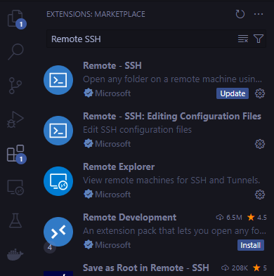

<div style="text-align: justify; margin-bottom: 15px;">
After you install the extension, you will see an extra button on the left side-panel and on the bottom left. If you don't, restart VS Code.
</div>

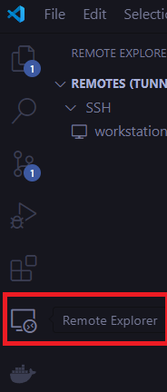

<div style="text-align: justify; margin-bottom: 15px;">
When you click the extension's button, you might see on the top right of the panel a drop-down menu. <b>Remote-ssh</b> lets you connect to other systems as well, such as docker. For our use-case, we need to select the <b>Remotes (Tunnels/SSH)</b> option if it's not already selected
</div>

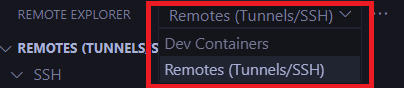

#### Connecting to Cyclone

<div style="text-align: justify; margin-bottom: 15px;">
Now that we have <b>Remote-SSH</b> installed, it's time to set it up so it can establish a connection on Cyclone.
</div>

<div style="text-align: justify; margin-bottom: 15px;">
If you followed the tutorials up until this point, you should have a private ssh key and a config file that lets you connect onto Cyclone through your terminal. We are going to use both to let VS Code connect onto Cyclone as well.
</div>

<div style="text-align: justify; margin-bottom: 15px;">
<blockquote>
<i>⚠️ If not, please refer to <a href="../t02_accessing_and_navigating_cyclone">Tutorial 2</a> for instructions on how to set this up.</i>
</blockquote>
</div>

<div style="text-align: justify; margin-bottom: 15px;">
Let's break it into steps:
</div>

##### **Step 1:** Go and add the following lines to your ssh config file.

<div style="text-align: justify; margin-bottom: 15px;">
The config file is located at:
</div>

<div style="text-align: justify; margin-bottom: 15px;">
<blockquote>
<b><i>Windows:</b></i> %userprofile%/.ssh/
<br>
<br>
<b><i>Linux & Mac:</b></i> ~/.ssh/
</blockquote>
</div>

<div style="text-align: justify; margin-bottom: 15px;">
Your SSH config file should get picked up by VS Code. You should see an option called <code>cyclone</code> on the left panel when you press the extension's button.
</div>

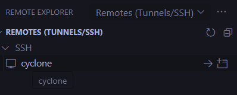

<div style="text-align: justify; margin-bottom: 15px;">
When you hover over that option, you will see two buttons on the right:
<ul>
<li>The first button will establish a connection on your current VS Code window</li>
<li>The second button will open a new VS Code window and establish a connection on that</li> 
</ul>
</div>

<div style="text-align: justify; margin-bottom: 15px;">
Go ahead and click the first button.
</div>

<div style="text-align: justify; margin-bottom: 15px;">
<blockquote>
<i>ℹ️ You might get a prompt to select the hosts (Cyclone) operating system. Go ahead and select Linux.</i>
</blockquote>
</div>

<div style="text-align: justify; margin-bottom: 15px;">
After that, if everything is setup correctly, you will get a prompt asking for a <b><i>passphrase</i></b>. Go ahead and type your passphrase and press enter. 
</div>

<div style="text-align: justify; margin-bottom: 15px;">
<b><i>That's it - you are now connected on Cyclone with VS Code!!</i></b>
</div>

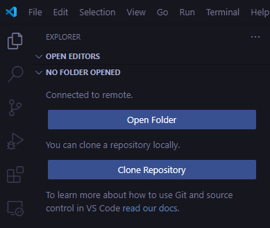

<div style="text-align: justify; margin-bottom: 15px;">
<b>Note:</b> Do not click <b><i>Open Folder</i></b> yet.
</div>

<div style="text-align: justify; margin-bottom: 15px;">
If you followed this tutorial series up to this point, you should be familiar on how Cyclone's file system is structured.
</div>

<div style="text-align: justify; margin-bottom: 15px;">
Just to remind you, Cyclone has 3 different directory types:

<blockquote>
<ul>
<li><b>$HOME</b> (<code>/nvme/h/&lt;username&gt;</code>): is the home directory of a user. Users should store their source code and build executables here. The home directory is limited in size.</li>
<br>
<li><b>$DATA_projectid</b> (<code>/nvme/h/&lt;username&gt;/data_&lt;projectid&gt;</code>): is the data directory of a user within the project shared directory. Users must change to this directory in their batch scripts to run their jobs. The data directory has a total maximum quota as allocated to each project.</li>
<br>
<li><b>$SCRATCH</b> (<code>/nvme/scratch/&lt;username&gt;</code>): is a temporary storage directory for data to reside. Month old contents of scratch directory are purged during the monthly maintenance windows.</li>
</ul>
</blockquote>
</div>

<div style="text-align: justify; margin-bottom: 15px;">
At the end of this tutorial, we are going to have a hands-on session, where we will use everything that we will learn. For this purpose, we are going to create a folder for our dummy project in our <b>$HOME</b> directory.
</div>

<div style="text-align: justify; margin-bottom: 15px;">
Open VS Code's terminal or your prefered one. Then go into your <b>$HOME</b> directory and create a folder by typing:
</div>

```bash
cd $HOME
mkdir tutorial_03_project
ls -l
```
<div style="text-align: justify; margin-bottom: 15px;">
The <code>ls -l</code> command should show our newly created folder.
</div>

<div style="text-align: justify; margin-bottom: 15px;">
Now click <b>Open Folder</b>, and select the folder that we just created. You will be prompted to insert your passphrase once more. After that, you will be able to see that folder on the left panel, when you click the remote-ssh extension button:
</div>

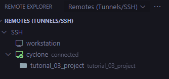

<div style="text-align: justify; margin-bottom: 15px;">
From now on, you will be able to establish a remote-ssh connection straight to that folder.
</div>

### 3.2.2. MobaXTerm

<div style="text-align: justify; margin-bottom: 15px;">
MobaXTerm is an all-in-one remote desktop and terminal solution designed for developers and system administrators. It provides a user-friendly interface for SSH connections, enabling easy access to Cyclone's HPC environment. With features like remote file editing, a built-in SFTP browser, and X11 forwarding, users can manage files, run graphical applications, and execute commands efficiently. MobaXTerm simplifies remote workflows, making it an excellent tool for working on Cyclone.
</div>

#### Setting up MobaXTerm (Windows Only)

<div style="text-align: justify; margin-bottom: 15px;">
<ol>
<li>Go to <a href="https://mobaxterm.mobatek.net/download.html"> this</a> URL, and download MobaXTerm.</li>
<li>After you download the zip folder, extract it, and run the <b>.msi</b> file located inside the folder. If you download the portable edition, then just double click the downloaded file and it will open the application straight away.</li>
<li>Follow the installer's steps until completion. Keep in mind, Administrative permission is required to install this software.</li>
<li>Go ahead and launch the software. You might be prompted to allow MobaXTerm to access private networks, click allow.</li>
</ol>
</div>

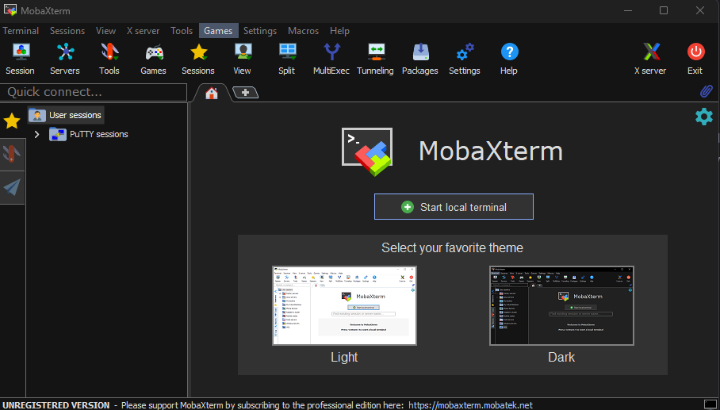

##### Launching an SSH session on MobaXTerm

<div style="text-align: justify; margin-bottom: 15px;">
There's a button on the top left corner called <i>Session</i>. Click that, and then select the first option that reads <i>SSH</i>.
</div>

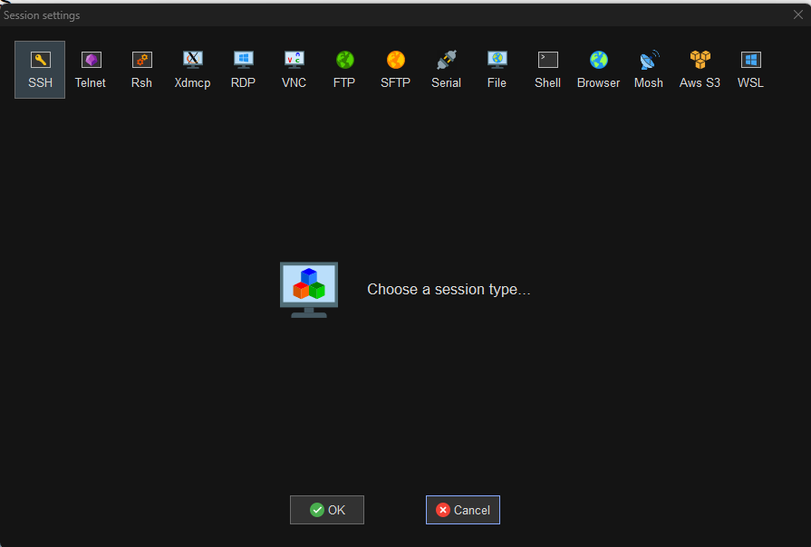

<div style="text-align: justify; margin-bottom: 15px;">
Afterwards, fill the Remote Host (<code>cyclone.hpcf.cyi.ac.cy</code>), click <i>Specify username</i> and type <b>your username</b>.
</div>

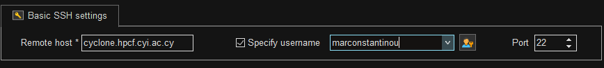

<div style="text-align: justify; margin-bottom: 15px;">
Lastly, we have to setup our SSH key. Click on <i>Advanced SSH settings</i>, then click <i>Use Private Key</i>, and then write the path of <b>your private key</b> for Cyclone.
</div>

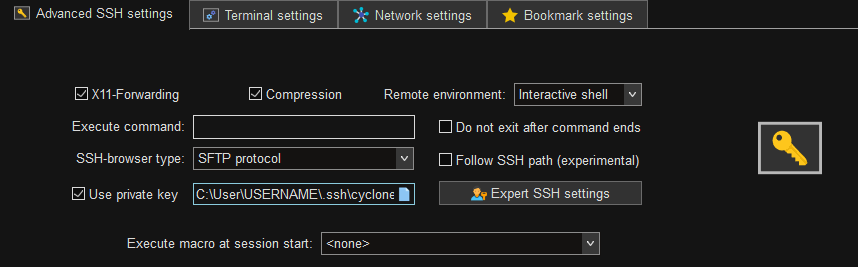

<div style="text-align: justify; margin-bottom: 15px;">
Click <i>OK</i>, you will then be prompted to insert your <i>Passphrase</i>.
</div>

<div style="text-align: justify; margin-bottom: 15px;">
After that you are done! You have an established connection to Cyclone with MobaXTerm.
</div>

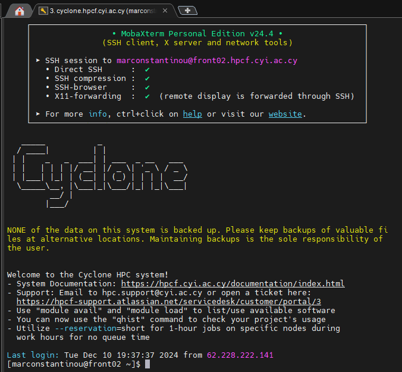

<div style="text-align: justify; margin-bottom: 15px;">
This tool is very versitile and has a lot of functionality. Please visit their <a href="https://mobaxterm.mobatek.net/documentation.html"> documentation page</a> to read more about it.
</div>

---

## 3.3. Using Cyclone's Module System

<div style="text-align: justify; margin-bottom: 15px;">
The OS of Cyclone is a <i>minimal Linux installation</i>. Software applications installed on the Cyclone, are available through the <b>Module</b> system. 
</div>

<div style="text-align: justify; margin-bottom: 15px;">
<blockquote>
<i>ℹ️ For basic overview of the Module system please refer at <a href="../t01_introduction_to_hpc_systems#16-introduction-to-modules"> T01 - Introduction to HPC Systems</a>.</i>
</blockquote>
</div>

### 3.3.1. Finding a module

<div style="text-align: justify; margin-bottom: 15px;">
There are two ways to search for modules:
</div>

<div style="text-align: justify; margin-bottom: 15px;">
<blockquote>
module avail
<br>
module spider
</blockquote>
</div>

<div style="text-align: justify; margin-bottom: 15px;">
The <code>module avail</code> command returns the names of all available modules. If you are a new user, it is recommended to use this command.
</div>

<div style="text-align: justify; margin-bottom: 15px;">
<blockquote>
<i>ℹ️ Some modules have the <code>(D)</code> next to them. This means they are the default module to be loaded when a version is not specified</i>
</blockquote>
</div>

```bash
[marconstantinou@front02 ~]$ module avail

---------------------------------------------------------------------- /eb/modules/all ----------------------------------------------------------------------
   4ti2/1.6.10-GCC-13.2.0                                                XZ/5.4.5-GCCcore-13.3.0                        (D)
   ABAQUS/2024                                                           Xerces-C++/3.2.4-GCCcore-12.3.0
   ANTLR/2.7.7-GCCcore-8.3.0-Java-11                                     Xvfb/21.1.3-GCCcore-11.3.0
   ASE/3.22.1-foss-2022a                                                 YACS/0.1.8-GCCcore-11.3.0
   ATK/2.38.0-GCCcore-11.3.0                                             Yasm/1.3.0-GCCcore-11.2.0
   Abseil/20230125.3-GCCcore-12.3.0                                      Yasm/1.3.0-GCCcore-11.3.0
   AmberTools/22.3-foss-2021b                                            Yasm/1.3.0-GCCcore-12.3.0
   AmberTools/22.3-foss-2022a                                    (D)     Yasm/1.3.0-GCCcore-13.2.0                      (D)
   Anaconda3/2021.11                                                     Z3/4.10.2-GCCcore-11.3.0
   Anaconda3/2023.03-1                                           (D)     Z3/4.12.2-GCCcore-12.3.0                       (D)
   ...
   XZ/5.2.5-GCCcore-11.2.0                                               zstd/1.5.0-GCCcore-11.2.0
   XZ/5.2.5-GCCcore-11.3.0                                       (L)     zstd/1.5.2-GCCcore-11.3.0
   XZ/5.2.7-GCCcore-12.2.0                                               zstd/1.5.2-GCCcore-12.2.0
   XZ/5.4.2-GCCcore-12.3.0                                               zstd/1.5.5-GCCcore-12.3.0
   XZ/5.4.4-GCCcore-13.2.0                                               zstd/1.5.5-GCCcore-13.2.0                      (D)

  Where:
   Aliases:  Aliases exist: foo/1.2.3 (1.2) means that "module load foo/1.2" will load foo/1.2.3
   D:        Default Module
   L:        Module is loaded

If the avail list is too long consider trying:

"module --default avail" or "ml -d av" to just list the default modules.
"module overview" or "ml ov" to display the number of modules for each name.

Use "module spider" to find all possible modules and extensions.
Use "module keyword key1 key2 ..." to search for all possible modules matching any of the "keys".
```


<div style="text-align: justify; margin-bottom: 15px;">
The <code>module spider</code> command shows a lot more information about the modules. Users can use the <code>avail</code> command to find the exact name of the module they are looking for, and then use the <code>spider</code> command on the exact name, to find more information about it
</div>

```bash
[marconstantinou@front02 ~]$ module spider

---------------------------------------------------------------------------------------------------------------------------------------------------------
The following is a list of the modules and extensions currently available:
---------------------------------------------------------------------------------------------------------------------------------------------------------
  4ti2: 4ti2/1.6.10-GCC-13.2.0
    A software package for algebraic, geometric and combinatorial problems on linear spaces

  ABAQUS: ABAQUS/2024
    Finite Element Analysis software for modeling, visualization and best-in-class implicit and explicit dynamics FEA.

  ANTLR: ANTLR/2.7.7-GCCcore-8.3.0-Java-11
    ANTLR, ANother Tool for Language Recognition, (formerly PCCTS) is a language tool that provides a framework for constructing recognizers, compilers,
    and translators from grammatical descriptions containing Java, C#, C++, or Python actions.

  ASE: ASE/3.22.1-foss-2022a
    ASE is a python package providing an open source Atomic Simulation Environment in the Python scripting language. From version 3.20.1 we also include
    the ase-ext package, it contains optional reimplementations in C of functions in ASE. ASE uses it automatically when installed.

  ATK: ATK/2.38.0-GCCcore-11.3.0
    ATK provides the set of accessibility interfaces that are implemented by other toolkits and applications. Using the ATK interfaces, accessibility
    tools have full access to view and control running applications. 

  ...

  zlib: zlib/1.2.8, zlib/1.2.11-GCCcore-8.3.0, zlib/1.2.11-GCCcore-10.2.0, zlib/1.2.11-GCCcore-11.2.0, zlib/1.2.11, zlib/1.2.12-GCCcore-11.3.0, ...
    zlib is designed to be a free, general-purpose, legally unencumbered -- that is, not covered by any patents -- lossless data-compression library for
    use on virtually any computer hardware and operating system.

  zstd: zstd/1.5.0-GCCcore-11.2.0, zstd/1.5.2-GCCcore-11.3.0, zstd/1.5.2-GCCcore-12.2.0, zstd/1.5.5-GCCcore-12.3.0, zstd/1.5.5-GCCcore-13.2.0
    Zstandard is a real-time compression algorithm, providing high compression ratios. It offers a very wide range of compression/speed trade-off, while
    being backed by a very fast decoder. It also offers a special mode for small data, called dictionary compression, and can create dictionaries from
    any sample set.

---------------------------------------------------------------------------------------------------------------------------------------------------------

To learn more about a package execute:

   $ module spider Foo

where "Foo" is the name of a module.

To find detailed information about a particular package you
must specify the version if there is more than one version:

   $ module spider Foo/11.1

---------------------------------------------------------------------------------------------------------------------------------------------------------
```

<div style="text-align: justify; margin-bottom: 15px;">
If we want to search more details about a specific package, such as <code>Python v.3.10.8</code>, then we can do so as follows:
</div>

```bash
[marconstantinou@front02 ~]$ module spider Python/3.10.8-GCCcore-12.2.0

---------------------------------------------------------------------------------------------------------------------------------------------------------
  Python: Python/3.10.8-GCCcore-12.2.0
---------------------------------------------------------------------------------------------------------------------------------------------------------
    Description:
      Python is a programming language that lets you work more quickly and integrate your systems more effectively.


    This module can be loaded directly: module load Python/3.10.8-GCCcore-12.2.0

    Help:
      
      Description
      ===========
      Python is a programming language that lets you work more quickly and integrate your systems
       more effectively.
      
      
      More information
      ================
       - Homepage: https://python.org/
      
      
      Included extensions
      ===================
      alabaster-0.7.12, appdirs-1.4.4, asn1crypto-1.5.1, atomicwrites-1.4.1,
      attrs-22.1.0, Babel-2.11.0, backports.entry-points-selectable-1.2.0,
      backports.functools_lru_cache-1.6.4, bcrypt-4.0.1, bitstring-3.1.9,
      blist-1.3.6, CacheControl-0.12.11, cachy-0.3.0, certifi-2022.9.24,
      cffi-1.15.1, chardet-5.0.0, charset-normalizer-2.1.1, cleo-1.0.0a5,
      click-8.1.3, clikit-0.6.2, colorama-0.4.6, crashtest-0.3.1,
      cryptography-38.0.3, Cython-0.29.32, decorator-5.1.1, distlib-0.3.6,
      docopt-0.6.2, docutils-0.19, dulwich-0.20.50, ecdsa-0.18.0, editables-0.3,
      exceptiongroup-1.0.1, filelock-3.8.0, flit-3.8.0, flit_core-3.8.0,
      flit_scm-1.7.0, fsspec-2022.11.0, future-0.18.2, glob2-0.7,
      hatch_fancy_pypi_readme-22.8.0, hatch_vcs-0.2.0, hatchling-1.11.1,
      html5lib-1.1, idna-3.4, imagesize-1.4.1, importlib_metadata-5.0.0,
      importlib_resources-5.10.0, iniconfig-1.1.1, intervaltree-3.1.0,
      intreehooks-1.0, ipaddress-1.0.23, jaraco.classes-3.2.3, jeepney-0.8.0,
      Jinja2-3.1.2, joblib-1.2.0, jsonschema-4.17.0, keyring-23.11.0,
      keyrings.alt-4.2.0, liac-arff-2.5.0, lockfile-0.12.2, MarkupSafe-2.1.1,
      mock-4.0.3, more-itertools-9.0.0, msgpack-1.0.4, netaddr-0.8.0,
      netifaces-0.11.0, packaging-21.3, paramiko-2.12.0, pastel-0.2.1,
      pathlib2-2.3.7.post1, pathspec-0.10.1, pbr-5.11.0, pexpect-4.8.0, pip-22.3.1,
      pkginfo-1.8.3, platformdirs-2.5.3, pluggy-1.0.0, poetry-1.2.2, poetry-
      core-1.3.2, poetry_plugin_export-1.2.0, psutil-5.9.4, ptyprocess-0.7.0,
      py-1.11.0, py_expression_eval-0.3.14, pyasn1-0.4.8, pycparser-2.21,
      pycrypto-2.6.1, Pygments-2.13.0, pylev-1.4.0, PyNaCl-1.5.0, pyparsing-3.0.9,
      pyrsistent-0.19.2, pytest-7.2.0, python-dateutil-2.8.2, pytoml-0.1.21,
      pytz-2022.6, regex-2022.10.31, requests-2.28.1, requests-toolbelt-0.9.1,
      scandir-1.10.0, SecretStorage-3.3.3, semantic_version-2.10.0,
      setuptools-63.4.3, setuptools-rust-1.5.2, setuptools_scm-7.0.5,
      shellingham-1.5.0, simplegeneric-0.8.1, simplejson-3.17.6, six-1.16.0,
      snowballstemmer-2.2.0, sortedcontainers-2.4.0, Sphinx-5.3.0, sphinx-bootstrap-
      theme-0.8.1, sphinxcontrib-applehelp-1.0.2, sphinxcontrib-devhelp-1.0.2,
      sphinxcontrib-htmlhelp-2.0.0, sphinxcontrib-jsmath-1.0.1, sphinxcontrib-
      qthelp-1.0.3, sphinxcontrib-serializinghtml-1.1.5, sphinxcontrib-
      websupport-1.2.4, tabulate-0.9.0, threadpoolctl-3.1.0, toml-0.10.2,
      tomli-2.0.1, tomli_w-1.0.0, tomlkit-0.11.6, typing_extensions-4.4.0,
      ujson-5.5.0, urllib3-1.26.12, virtualenv-20.16.6, wcwidth-0.2.5,
      webencodings-0.5.1, wheel-0.38.4, xlrd-2.0.1, zipfile36-0.1.3, zipp-3.10.0
```


### 3.3.2. Managing modules

#### Loading a module

<div style="text-align: justify; margin-bottom: 15px;">
By using <code>module load $MODULE_NAME</code> you can load and use <code>$MODULE_NAME</code>.
</div>

<div style="text-align: justify; margin-bottom: 15px;">
<b>Example:</b> Using Python <code>v3.10.4</code> instead of system default (<code>v3.10.13</code>)
</div>

```bash
[marconstantinou@front02 ~]$ python -V # Check if Python is loaded
Python 3.10.13 # Python v3.10.13 is loaded by default
[marconstantinou@front02 ~]$ module avail python # This will print all available python modules
------------------------------- /eb/modules/all --------------------------------
   ...
   Python/2.7.16-GCCcore-8.3.0
   Python/2.7.18-GCCcore-11.2.0-bare
   Python/2.7.18-GCCcore-11.2.0
   Python/3.7.4-GCCcore-8.3.0
   Python/3.8.6-GCCcore-10.2.0
   Python/3.9.6-GCCcore-11.2.0-bare
   Python/3.9.6-GCCcore-11.2.0
   Python/3.10.4-GCCcore-11.3.0-bare
   Python/3.10.4-GCCcore-11.3.0
   Python/3.10.8-GCCcore-12.2.0-bare
   Python/3.10.8-GCCcore-12.2.0
   Python/3.11.3-GCCcore-12.3.0
   Python/3.11.5-GCCcore-13.2.0
   Python/3.12.3-GCCcore-13.3.0                            (D)
   ...

  Where:
   D:  Default Module

If the avail list is too long consider trying:

"module --default avail" or "ml -d av" to just list the default modules.
"module overview" or "ml ov" to display the number of modules for each name.

Use "module spider" to find all possible modules and extensions.
Use "module keyword key1 key2 ..." to search for all possible modules matching
any of the "keys".
[marconstantinou@front02 ~]$ module load Python/3.10.4-GCCcore-11.3.0 # Load Python 3.10.4
[marconstantinou@front02 ~]$ python -V
Python 3.10.4
```

#### Checking loaded modules

<div style="text-align: justify; margin-bottom: 15px;">
To see what modules are already loaded and used in your environment, we can type:
</div>

<div style="text-align: justify; margin-bottom: 15px;">
<blockquote>
module list
</blockquote>
</div>

```bash
[marconstantinou@front02 ~]$ module list

Currently Loaded Modules:
  1) GCCcore/11.3.0                 5) ncurses/6.3-GCCcore-11.3.0         9) XZ/5.2.5-GCCcore-11.3.0      13) Python/3.10.4-GCCcore-11.3.0
  2) zlib/1.2.12-GCCcore-11.3.0     6) libreadline/8.1.2-GCCcore-11.3.0  10) GMP/6.2.1-GCCcore-11.3.0
  3) binutils/2.38-GCCcore-11.3.0   7) Tcl/8.6.12-GCCcore-11.3.0         11) libffi/3.4.2-GCCcore-11.3.0
  4) bzip2/1.0.8-GCCcore-11.3.0     8) SQLite/3.38.3-GCCcore-11.3.0      12) OpenSSL/1.1
```

<div style="text-align: justify; margin-bottom: 15px;">
This will show the currently loaded modules. Note here we also see <code>Python/3.10.4-GCCcore-11.3.0</code> being available (along with any dependencies), following the previous example.
</div>

#### Unload a module

<div style="text-align: justify; margin-bottom: 15px;">
Following the previous example, to unload the loaded Python version, we can do so by using the <code>module unload</code> command. This will remove the specified module from the loaded modules of your environment.
</div>

<div style="text-align: justify; margin-bottom: 15px;">
<b>Example:</b> Removing Python 3.10.4 From the Environment
</div>

```bash
[marconstantinou@front02 ~]$ module unload Python/3.10.4-GCCcore-11.3.0
[marconstantinou@front02 ~]$ module list

Currently Loaded Modules:
  1) GCCcore/11.3.0                 4) bzip2/1.0.8-GCCcore-11.3.0         7) Tcl/8.6.12-GCCcore-11.3.0     10) GMP/6.2.1-GCCcore-11.3.0
  2) zlib/1.2.12-GCCcore-11.3.0     5) ncurses/6.3-GCCcore-11.3.0         8) SQLite/3.38.3-GCCcore-11.3.0  11) libffi/3.4.2-GCCcore-11.3.0
  3) binutils/2.38-GCCcore-11.3.0   6) libreadline/8.1.2-GCCcore-11.3.0   9) XZ/5.2.5-GCCcore-11.3.0       12) OpenSSL/1.1
[marconstantinou@front02 ~]$ python -V
Python 3.10.13
```

<div style="text-align: justify; margin-bottom: 15px;">
You can also switch from one version to another in one go via <code>module swap</code>:
</div>

```bash
[marconstantinou@front02 ~]$ module swap Python/3.10.4-GCCcore-11.3.0 Python/3.12.3-GCCcore-13.3.0 

The following have been reloaded with a version change:
  1) GCCcore/11.3.0 => GCCcore/13.3.0                                 7) binutils/2.38-GCCcore-11.3.0 => binutils/2.42-GCCcore-13.3.0
  2) OpenSSL/1.1 => OpenSSL/3                                         8) bzip2/1.0.8-GCCcore-11.3.0 => bzip2/1.0.8-GCCcore-13.3.0
  3) Python/3.10.4-GCCcore-11.3.0 => Python/3.12.3-GCCcore-13.3.0     9) libffi/3.4.2-GCCcore-11.3.0 => libffi/3.4.5-GCCcore-13.3.0
  4) SQLite/3.38.3-GCCcore-11.3.0 => SQLite/3.45.3-GCCcore-13.3.0    10) libreadline/8.1.2-GCCcore-11.3.0 => libreadline/8.2-GCCcore-13.3.0
  5) Tcl/8.6.12-GCCcore-11.3.0 => Tcl/8.6.14-GCCcore-13.3.0          11) ncurses/6.3-GCCcore-11.3.0 => ncurses/6.5-GCCcore-13.3.0
  6) XZ/5.2.5-GCCcore-11.3.0 => XZ/5.4.5-GCCcore-13.3.0              12) zlib/1.2.12-GCCcore-11.3.0 => zlib/1.3.1-GCCcore-13.3.0
```

<div style="text-align: justify; margin-bottom: 15px;">
<b>Note:</b> The module system takes care of any relevant dependencies to the requested module we are trying to load. Therefore, switching from one version to another, the correct version of each dependency is reloaded automatically.
</div>

#### Reset loaded modules

<div style="text-align: justify; margin-bottom: 15px;">
To start from a clean environemnt we can use the <code>purge</code> command.
</div>

<div style="text-align: justify; margin-bottom: 15px;">
<blockquote>
module purge
</blockquote>
</div>

<div style="text-align: justify; margin-bottom: 15px;">
This will unload all the modules:
</div>

```bash
[marconstantinou@front02 ~]$ module list

Currently Loaded Modules:
  1) GMP/6.2.1-GCCcore-11.3.0       5) bzip2/1.0.8-GCCcore-13.3.0       9) SQLite/3.45.3-GCCcore-13.3.0  13) Python/3.12.3-GCCcore-13.3.0
  2) GCCcore/13.3.0                 6) ncurses/6.5-GCCcore-13.3.0      10) XZ/5.4.5-GCCcore-13.3.0
  3) zlib/1.3.1-GCCcore-13.3.0      7) libreadline/8.2-GCCcore-13.3.0  11) libffi/3.4.5-GCCcore-13.3.0
  4) binutils/2.42-GCCcore-13.3.0   8) Tcl/8.6.14-GCCcore-13.3.0       12) OpenSSL/3

[marconstantinou@front02 ~]$ module purge
[marconstantinou@front02 ~]$ module list
No modules loaded
```

<div style="text-align: justify; margin-bottom: 15px;">
<b>Note:</b> It is recommended to use before loading any modules, because modules loaded on your login environment are curried over to your job environment. This is a good way to make sure that there are no left over modules.
</div>

---

## 3.4. Using `conda` to Manage Python Virtual Environments

<div style="text-align: justify; margin-bottom: 15px;">
<code>conda</code> is an open-source package management and environment management system widely used in data science, machine learning, and software development. It simplifies the installation, updating, and management of software packages and their dependencies across various programming languages, including <code>Python</code>, <code>R</code>, and <code>C++</code>. <code>conda</code> also enables users to <b>create isolated environments, allowing them to work on multiple projects with different dependencies without conflicts</b>. It supports a wide range of operating systems and can manage libraries for scientific computing, data analysis, and machine learning efficiently.
</div>

<div style="text-align: justify; margin-bottom: 15px;">
<blockquote>
<i>ℹ️ The <b>official documentation</b> for Anaconda can be found <a href="https://docs.anaconda.com/">here</a>.</i>
</blockquote>
</div>

### 3.4.1. Creating an environment

<div style="text-align: justify; margin-bottom: 15px;">
You can create an empty environment by running:
</div>

```bash
# Replace <ENV_NAME> with a name for your environment
[marconstantinou@front02 ~]$ conda create -n <ENV_NAME>
```

<div style="text-align: justify; margin-bottom: 15px;">
or if you want to create an environment with Python and other packages, run this:
</div>

```bash
# Replace <ENV_NAME> with a name for your environment
# Replace <PACKAGE> with your desired package
# Replace <VERSION> with your desired version of Python
[marconstantinou@front02 ~]$ conda create -n <ENV_NAME> python=<VERSION> <PACKAGE>=<VERSION>
```

<div style="text-align: justify; margin-bottom: 15px;">
<b>Example:</b> Creating an environment with <code>Python 3.11</code> and other specific libraries
</div>

<div style="text-align: justify; margin-bottom: 15px;">
<blockquote>
conda create -n myenv python=3.11 beautifulsoup4 docutils jinja2=3.1.4 wheel
</blockquote>
</div>

### 3.4.2. Activating an environment

<div style="text-align: justify; margin-bottom: 15px;">
To activate your environment, simply run:
</div>

```bash
# Replace <ENV_NAME> with the name of the environment you want to activate
[marconstantinou@front02 ~]$ conda activate <ENV_NAME>
(ENV_NAME)[marconstantinou@front02 ~]$ 
```

<div style="text-align: justify; margin-bottom: 15px;">
You should now be able to see <code>(ENV_NAME)</code> next to your user name.
</div>

### 3.4.3. Switching between environments

<div style="text-align: justify; margin-bottom: 15px;">
If you want to switch to a different environment you can run these commands:
</div>

```bash
# Show all available environments
(base)[marconstantinou@front02 ~]$ conda info --envs
# conda environments:
#
base                  *  /nvme/h/buildsets/eb_cyclone_rl/software/Anaconda3/2023.03-1
juplab                   /nvme/h/marconstantinou/.conda/envs/juplab
myenv                    /nvme/h/marconstantinou/.conda/envs/myenv

# Replace <ENV_NAME> with the name of the environment you want to switch to
(base)[marconstantinou@front02 ~]$ conda activate <ENV_NAME>
(ENV_NAME)[marconstantinou@front02 ~]$ 
```

<div style="text-align: justify; margin-bottom: 15px;">
<blockquote>
<i>ℹ️ Activating a different environment will deactivate your current one.</i>
</blockquote>
</div>

### 3.4.4. Deactivating an environment

<div style="text-align: justify; margin-bottom: 15px;">
To deactivate your current environment, simply type:
</div>

```bash
(ENV_NAME)[marconstantinou@front02 ~]$ conda deactivate
(base)[marconstantinou@front02 ~]$ 
```

<div style="text-align: justify; margin-bottom: 15px;">
<blockquote>
<i>💡 Upon deactivation, the environment will switch to the <code>base</code> acting as the default environment. If you want to deactivate <code>conda</code> completely, repeat <code>conda deactivate</code>.</i>
</blockquote>
</div>

### 3.4.5. Exporting an environment

<div style="text-align: justify; margin-bottom: 15px;">
Do not attempt to copy the environment's files to a different machine. It will <b>not</b> recreate the environment. We must export the environment and install it again. To export the environment, simply run:
</div>

```bash
# Replace <ENV_NAME> with the name of the environment you want exported
(base)[marconstantinou@front02 ~]$ conda activate <ENV_NAME>
(ENV_NAME)[marconstantinou@front02 ~]$ conda env export > environment.yml
```

<div style="text-align: justify; margin-bottom: 15px;">
<blockquote>
<i>ℹ️ This will handle both <code>conda</code> and <code>pip</code>'s packages.</i>
</blockquote>
</div>

<div style="text-align: justify; margin-bottom: 15px;">
In your current directory you should see a file called <b><i>environment.yml</b></i>. You can take this file to the machine you want to export the environment and run:
</div>

```bash
(base)[marconstantinou@front02 ~]$ conda env create -f environment.yml
```

<div style="text-align: justify; margin-bottom: 15px;">
After this, you can activate the environment and use it as is.
</div>

---

## 3.5. Using `venv` to manage Python virtual environments

<div style="text-align: justify; margin-bottom: 15px;">
The <code>venv</code> module in Python is a tool to create isolated environments for your projects. This ensures that dependencies for one project don’t interfere with those of another. Here's how to get started with <code>venv</code>.
</div>

<div style="text-align: justify; margin-bottom: 15px;">
<code>venv</code> and <code>conda</code> both create isolated environments for Python projects, but they differ in scope and functionality. <code>venv</code> is a lightweight, Python-specific tool for isolating packages installed via <code>pip</code>, relying on the system's Python interpreter. In contrast, <code>conda</code> is a cross-language package and environment manager that can handle both Python and non-Python dependencies, including system libraries, and comes with its own Python interpreter. While <code>venv</code> is simple and built into Python, <code>conda</code> is more feature-rich, making it ideal for data science and projects with complex dependencies.
</div>

### 3.5.1. Creating a virtual environment

<div style="text-align: justify; margin-bottom: 15px;">
Navigate to your project's directory:
</div>

```bash
[marconstantinou@front02 ~]$ cd /path/to/your/project
```

<div style="text-align: justify; margin-bottom: 15px;">
Create a <code>venv</code> environment:
</div>

```bash
# REPLACE venv_name with the name you want to give to your environment
[marconstantinou@front02 ~]$ python -m venv venv_name
```

### 3.5.2. Activating a virtual environment

<div style="text-align: justify; margin-bottom: 15px;">
To start using the virtual environment, you need to activate it via:
</div>

```bash
[marconstantinou@front02 ~]$ source venv_name/bin/activate
(venv_name)[marconstantinou@front02 ~]$ 
```

### 3.5.3. Installing packages

<div style="text-align: justify; margin-bottom: 15px;">
Once you activate the environment you can start installing packages via simply running:
</div>

<div style="text-align: justify; margin-bottom: 15px;">
<blockquote>
pip install package_name
</blockquote>
</div>

<div style="text-align: justify; margin-bottom: 15px;">
<b>Example:</b> Installing <code>numpy</code>
</div>

```bash
[marconstantinou@front02 ~]$ pip install numpy
(venv_name) [marconstantinou@front02 ~]$ pip install numpy
Collecting numpy
  Downloading numpy-2.2.2-cp312-cp312-manylinux_2_17_x86_64.manylinux2014_x86_64.whl.metadata (62 kB)
     ━━━━━━━━━━━━━━━━━━━━━━━━━━━━━━━━━━━━━━━━ 62.0/62.0 kB 1.2 MB/s eta 0:00:00
Downloading numpy-2.2.2-cp312-cp312-manylinux_2_17_x86_64.manylinux2014_x86_64.whl (16.1 MB)
   ━━━━━━━━━━━━━━━━━━━━━━━━━━━━━━━━━━━━━━━━ 16.1/16.1 MB 22.2 MB/s eta 0:00:00
Installing collected packages: numpy
Successfully installed numpy-2.2.2
```

<div style="text-align: justify; margin-bottom: 15px;">
You can see what packages you have installed by typing:
</div>

```bash
(venv_name) [marconstantinou@front02 ~]$ pip list
Package Version
------- -------
numpy   2.2.2
pip     24.0
```

### 3.5.4. Deleting a virtual environment

<div style="text-align: justify; margin-bottom: 15px;">
To delete the environment simply type:
</div>

```bash
(venv_name) [marconstantinou@front02 ~]$ rm -rf venv_name
```

---

## 3.6. Hands-on Exercise

<div style="text-align: justify; margin-bottom: 15px;">
In this exercise, we will:
<ol>
<li>connect to Cyclone using VS Code (you can use whatever interface you prefer)</li>
<li>create a directory for our small project</li>
<li>load some modules</li>
<li>create a virtual environment for our python scripts</li>
<li>and finally we will run a small python file.</li>
</ol>
</div>

### 3.6.1. Setup our project's directory

<div style="text-align: justify; margin-bottom: 15px;">
Open up VS Code and connect to Cyclone. Once connected, go to the terminal and into your <code>$HOME</code> dir.
</div>

<div style="text-align: justify; margin-bottom: 15px;">
<blockquote>
<i>⚠️ Please keep in mind that you can do all these by using the graphical interface of VS Code - if you prefer that way, then go ahead and do that.</i>
</blockquote>
</div>

```bash
[marconstantinou@front02 ~]$ pwd
/nvme/h/marconstantinou
```

<div style="text-align: justify; margin-bottom: 15px;">
If you are not in your <code>$HOME</code> directory, type:
</div>

```bash
[marconstantinou@front02 ~]$ cd $HOME
```

<div style="text-align: justify; margin-bottom: 15px;">
To create our hands-on directory, type:
</div>

```bash
[marconstantinou@front02 ~]$ mkdir tutorial_03_project/
```

<div style="text-align: justify; margin-bottom: 15px;">
If you followed all the steps until now, you should see a <code>tutorial_03_project</code> directory when you type this command:
</div>

```bash
[marconstantinou@front02 ~]$ ls -l
total 2
lrwxrwxrwx  1 marconstantinou p232        15 Nov  4 10:20 data_p232 -> /onyx/data/p232
lrwxrwxrwx  1 marconstantinou p232        19 Nov  4 11:22 edu24 -> /onyx/data/edu24
lrwxrwxrwx  1 marconstantinou p232        29 Nov  4 10:20 scratch -> /nvme/scratch/marconstantinou
drwxr-xr-x  2 marconstantinou p232         0 Dec 10 15:26 tutorial_03_project
```

<div style="text-align: justify; margin-bottom: 15px;">
Go inside that directory:
</div>

```bash
[marconstantinou@front02 ~]$ cd tutorial_03_project/
```

<div style="text-align: justify; margin-bottom: 15px;">
Then create a <code>main.py</code> file:
</div>

```bash
[marconstantinou@front02 ~]$ touch main.py
[marconstantinou@front02 ~]$ ls -l
-rw-r--r-- 1 marconstantinou p232 0 Dec 19 11:40 main.py
```

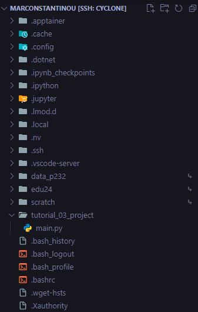

<div style="text-align: justify; margin-bottom: 15px;">
Now that we have our directory and script ready, lets load some module and install some packages.
</div>

### 3.6.2. Load CUDA module

<div style="text-align: justify; margin-bottom: 15px;">
Again, in your terminal connected to Cyclone, type:
</div>

```bash
[marconstantinou@front02 ~]$ module avail CUDA

------------------------------------------- /eb/modules/all --------------------------------------------
   CUDA/10.1.243
   CUDA/11.4.1
   CUDA/11.7.0
   CUDA/11.8.0
   CUDA/12.0.0
   CUDA/12.1.0
   CUDA/12.1.1
   CUDA/12.6.0                                                   (D)
   ...

  Where:
   D:  Default Module

If the avail list is too long consider trying:

"module --default avail" or "ml -d av" to just list the default modules.
"module overview" or "ml ov" to display the number of modules for each name.

Use "module spider" to find all possible modules and extensions.
Use "module keyword key1 key2 ..." to search for all possible modules matching any of the "keys".
```

<div style="text-align: justify; margin-bottom: 15px;">
Let's load <code>CUDA/12.1.1</code>:
</div>

```bash
[marconstantinou@front02 ~]$ module load CUDA/12.1.1
```

### 3.6.3. Create a `conda` environment for our project and install some libraries

<div style="text-align: justify; margin-bottom: 15px;">
We are going to create a <code>conda</code> virtual environment, and install <code>PyTorch</code> which is a Deep Learning framework.
</div>

<div style="text-align: justify; margin-bottom: 15px;">
First we need to load Anaconda using the module system:
</div>

```bash
[marconstantinou@front02 ~]$ module load Anaconda3/2023.03-1
```

<div style="text-align: justify; margin-bottom: 15px;">
Then run:
</div>

```bash
[marconstantinou@front02 ~]$ conda init
```

<div style="text-align: justify; margin-bottom: 15px;">
Now restart your terminal. When you open a new terminal and connect to Cyclone, you should be able to create an environment and activate it.
</div>

<div style="text-align: justify; margin-bottom: 15px;">
To do this, type:
</div>

```bash
(base)[marconstantinou@front02 ~]$ conda create --name dummy_proj pytorch torchvision torchaudio pytorch-cuda=12.1 -c pytorch -c nvidia
```

<div style="text-align: justify; margin-bottom: 15px;">
<blockquote>
<i>⚠️ This will take some time to install, be patient.</i>
</blockquote>
</div>

<div style="text-align: justify; margin-bottom: 15px;">
After everything is installed, go ahead and request a single GPU for 30 minutes on GPU partition of Cyclone by typing:
</div>

```bash
# Start a 30 minute interactive session on a GPU node
(base)[marconstantinou@front02 ~]$ srun --partition=gpu --gres=gpu:1 --time=00:30:00 --pty bash
```

<div style="text-align: justify; margin-bottom: 15px;">
You might see something like this:
</div>

```bash
srun: job 1037413 queued and waiting for resources
```

<div style="text-align: justify; margin-bottom: 15px;">
This mean that cyclone is being utilized, and that our job is in queue until resourcers are found. Please give SLURM some time to allocate some resources to our request.
</div>

<div style="text-align: justify; margin-bottom: 15px;">
Once the allocation of resources is successful, the <code>front02</code> hostname shown on the terminal next to your username will be changed to the allocated node. In this case, the allocated node is <code>gpu01</code> (Note it might differ from yours!). Then we want to activate our environment:
</div>

```bash
(base)[marconstantinou@gpu01 ~]$ conda activate dummy_proj
```

<div style="text-align: justify; margin-bottom: 15px;">
You can check which libraries are installed in your <code>conda</code> environment by typing
</div>

```bash
(dummy_proj)[marconstantinou@gpu01 ~]$ conda list
```

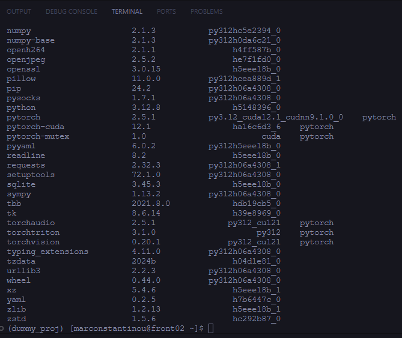

### 3.6.4. Select the correct Python Interpreter in VS Code

<div style="text-align: justify; margin-bottom: 15px;">
On the top of VS Code, click and type the following:
</div>

> \> Python: Select Interpreter

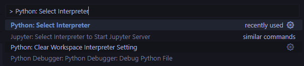

<div style="text-align: justify; margin-bottom: 15px;">
Click enter and then select the newly created conda environment:
</div>

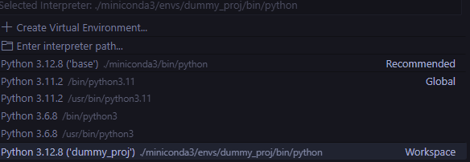

### 3.6.5. Running a python script on a GPU Node

<div style="text-align: justify; margin-bottom: 15px;">
Copy and paste the following code snippet inside the <code>main.py</code> file that we created earlier. This file should be inside the directory <code>tutorial_03_project</code>
</div>

```python
import sys

import torch


def check_pytorch_installation():
    try:
        # Check if PyTorch is installed
        print(f"PyTorch version: {torch.__version__}")
    except ImportError:
        print("PyTorch is not installed.")
        sys.exit(1)

def check_cuda_support():
    if torch.cuda.is_available():
        print("CUDA is available!")
        print(f"CUDA version: {torch.version.cuda}")
        print(f"Number of GPUs available: {torch.cuda.device_count()}")
        print(f"GPU Name: {torch.cuda.get_device_name(0)}")
    else:
        print("CUDA is not available. Please ensure that your system has a compatible GPU and CUDA setup.")

def main():
    print("Checking PyTorch and CUDA installation...")
    check_pytorch_installation()
    check_cuda_support()
    print("Verification complete.")

if __name__ == "__main__":
    main()
```

<div style="text-align: justify; margin-bottom: 15px;">
Now save it, and inside your terminal run:
</div>

```bash
(dummy_proj)[marconstantinou@gpu01 tutorial_03_project]$ python main.py
```

<div style="text-align: justify; margin-bottom: 15px;">
<blockquote>
<i>⚠️ The above command assumes you are in the directory of the <code>main.py</code> file. If you are in a different directory, you will have to edit the above command.</i>
</blockquote>
</div>

<div style="text-align: justify; margin-bottom: 15px;">
You should see the following:
</div>

```bash
Checking PyTorch and CUDA installation...
PyTorch version: 2.5.1
CUDA is available!
CUDA version: 12.1
Number of GPUs available: 1
GPU Name: Tesla V100-SXM2-32GB
Verification complete.
```

<div style="text-align: justify; margin-bottom: 15px;">
And that's all!
</div>

<div style="text-align: justify; margin-bottom: 15px;">
You created a directory for your project, loaded some modules, created a conda environment with some libraries, and then you run some python code on a GPU Node.
</div>

### 3.6.6. Closing our interactive job session

<div style="text-align: justify; margin-bottom: 15px;">
Inside your terminal go ahead and type:
</div>

```bash
(dummy_proj)[marconstantinou@gpu01 ~]$ squeue --me
```

<div style="text-align: justify; margin-bottom: 15px;">
You should see 1 job with a <i>JOBID</i>, copy that <i>JOBID</i> and type:
</div>

```bash
# Replace JOBID with the ID of your job that you just copied
(dummy_proj)[marconstantinou@gpu01 ~]$ scancel JOBID

# Example
(dummy_proj)[marconstantinou@gpu01 ~]$ scancel 1037152
```

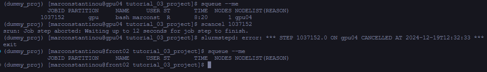

---
