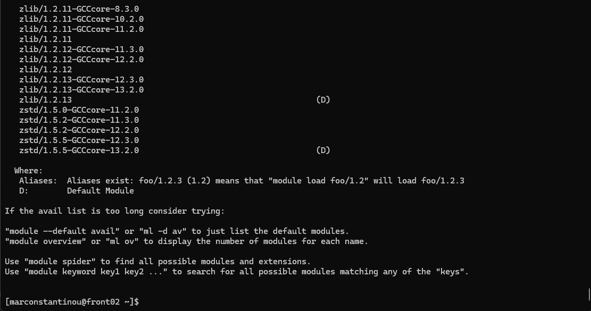
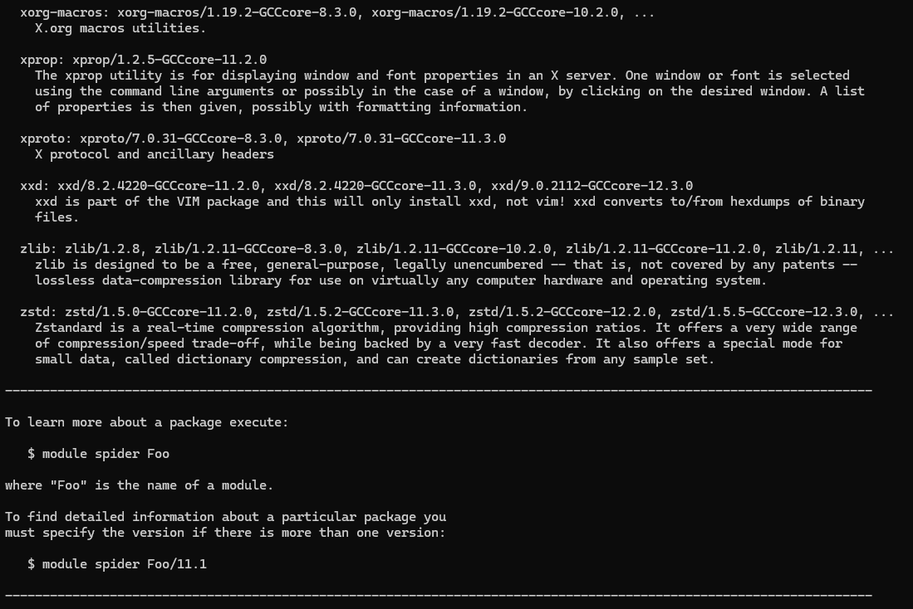
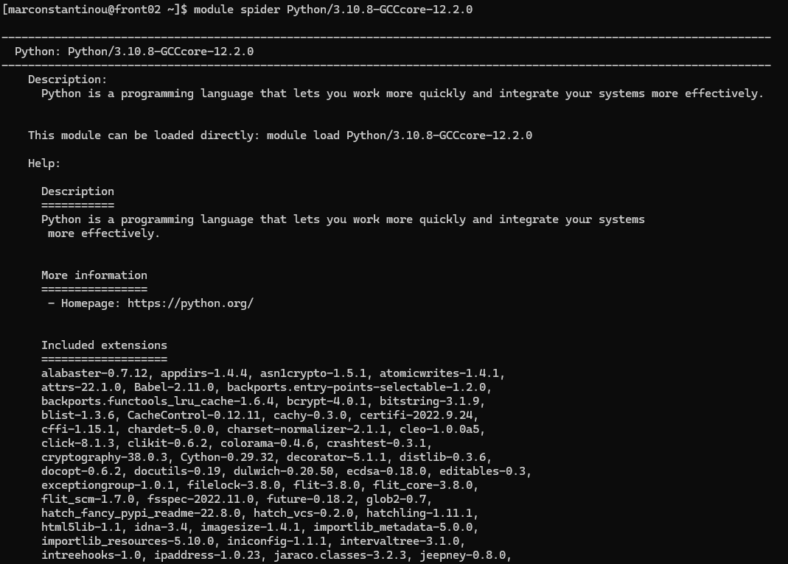
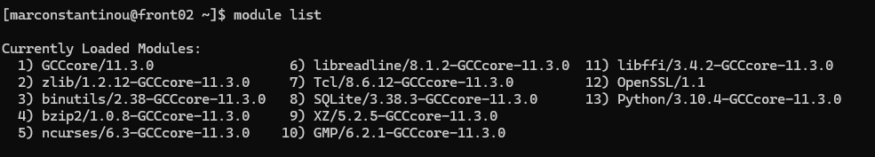
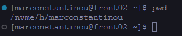
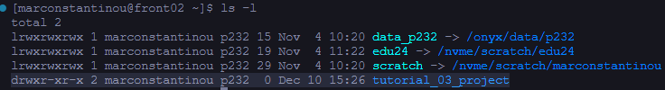

<!--
 t03_setting_up_and_using_development_tools.md

 CaSToRC, The Cyprus Institute

 (c) 2024 The Cyprus Institute

 Contributing Authors:
 Marios Constantinou (mar.constantinou@cyi.ac.cy)
 Kyriaki Kylili (k.kylili@cyi.ac.cy)
 
 Licensed under the Apache License, Version 2.0 (the "License");
 you may not use this file except in compliance with the License.
 You may obtain a copy of the License at
 
     https://www.apache.org/licenses/LICENSE-2.0
 
 Unless required by applicable law or agreed to in writing, software
 distributed under the License is distributed on an "AS IS" BASIS,
 WITHOUT WARRANTIES OR CONDITIONS OF ANY KIND, either express or implied.
 See the License for the specific language governing permissions and
 limitations under the License.
-->

# 3. Setting up and Using Development Tools

This tutorial will cover the following:

- How to setup and use various tools such as VS Code, and MobaXTerm for remote development on Cyclone
- How to use the module system to load various software environments onto your session
- How to use Conda / venv to handle your python virtual environments

## 3.1. Prerequisites

[Accessing and Navigating Cyclone](https://github.com/CaSToRC-CyI/eurocc2_cyclone_tutorials/blob/main/tutorials/t02_accessing_and_navigating_cyclone.md)

## 3.2. Tools for development

In this section we will cover how to setup VS Code and MobaXTerm, so the user can connect to Cyclone,and start developing.

### 3.2.1. VS Code

Visual Studio Code (VS Code) is a versatile code editor widely used for software development. With the Remote - SSH extension, it enables seamless connection to Cyclone, allowing users to edit, debug, and manage code directly on the HPC system. This eliminates the need for constant file transfers and provides a familiar development environment. By using VS Code, developers can streamline workflows and enhance productivity on Cyclone.

#### Downloading VS Code

Users should follow this [link](https://code.visualstudio.com/download), and download the appropriate VS Code installer based on their OS. Then, follow the on-screen instuctions during the installation.

#### Setting up VS Code

Once the installation is finished, it is time to install some basic extensions.

Depending on your code-base, you might want to install some code extensions such as [Python](https://marketplace.visualstudio.com/items?itemName=ms-python.python). Furthermore, there are various extensions that provide extended support for code predictions / auto-completions. Feel free to browse the Extension Marketplace and download the ones you need!

The only extension that is 100% mandatory for this tutorial is the [*Remote-SSH extension*](https://marketplace.visualstudio.com/items?itemName=ms-vscode-remote.remote-ssh). *Remote-SSH* enables you to use any remote machine with an SSH server as your development environment.

Go ahead and search Remote - SSH in the Extension Marketplace and install it.


After you install the extension, you will see an extra button on the left side-panel and on the bottom left. If you don't, restart VS Code.


When you click the extension's button, you might see on the top right of the panel a drop-down menu. *Remote-ssh* lets you connect to other systems as well, such as docker. For our use-case, we need to select the *Remotes (Tunnels/SSH)* option if it's not already selected.


---

Now that we have *Remote-SSH* installed, it's time to set it up so it can establish a connection on Cyclone.

If you followed the tutorials up until this point, you should have a private ssh key that lets you connect onto Cyclone through your terminal. We are going to use that key, to let VS Code connect onto Cyclone as well.

Let's break it into steps:

1. Go and add the following lines to your ssh config file.

The config file is located at:

> ***Windows:*** %userprofile%/.ssh/
>
> ***Linux & Mac:*** ~/.ssh/

```txt
Host cyclone
    HostName cyclone.hpcf.cyi.ac.cy
    User USERNAME
    IdentityFile ~/.ssh/YOUR_PRIVATE_KEY.ppk
```

After that, save your ssh config file and re-open VS Code. You should now see an option called cyclone on the left panel when you press the extension's button.

***Note:*** If you created your ssh-key using PuTTYgen, you will need to export that key into an OpenSSH key in order for this to work.

> To do this, open PuTTYgen, load your key, and under the Conversions tab, select *Export OpenSSH key (force new file format)*. Save the exported key in your ~/.ssh directory.
>
> You can create a different folder in your .ssh directory, call it something vs_code_keys, and place the exported key in there. In the config file above, make sure you set the correct path.


When you hover over that option, you will see two buttons on the right. The first button will establish a connection on your current VS Code window, the second button will open a new VS Code window, and establish a connection on that. Go ahead and click the first button.

You might get a prompt to select the hosts (Cyclone) operating system. Go ahead and select Linux.

After that, if everything is setup correctly, you will get a prompt asking for a ***passphrase***. Go ahead and type your passphrase and press enter.

That's it! You are now connected on Cyclone with VS Code.


**Note:** Do not click *Open Folder* yet.

If you followed this tutorial series up to this point, you should be familiar on how Cyclone's file system is structured.

Just to remind you, Cyclone has 3 different directory types:

> - *$HOME* **(/nvme/h/\<username>):** is the home directory of a user. Users should store their source code and build executables here. The home directory is limited in size.
>
> - *$DATA_projectid* **(/nvme/h/\<username>/data_\<projectid>):** is the data directory of a user within the project shared directory. Users must change to this directory in their batch scripts to run their jobs. The data directory has a total maximum quota as allocated to each project.
>
> - *$SCRATCH* **(/nvme/scratch/\<username>):** is a temporary storage directory for data to reside. Month old contents of scratch directory are purged during the monthly maintenance windows.

At the end of this tutorial, we are going to have a hands-on session, where we will use everything that we will learn. For this purpose, we are going to create a folder for our dummy project in our *HOME* directory.

Open VS Code's terminal or your prefered one. Then go into your *HOME* directory and create a folder by typing:

```bash
cd $HOME
mkdir tutorial_03_project
ls -l
```

The *ls -l* command should show our newly created folder.

Now click *Open Folder*, and select the folder that we just created. You will be prompted to insert your passphrase once more.

After that, you will be able to see that folder on the left panel, when you click the remote-ssh extension button:


In the future, you will be able to establish a remote-ssh connection straight to that folder.

### 3.2.2. MobaXTerm

MobaXTerm is an all-in-one remote desktop and terminal solution designed for developers and system administrators. It provides a user-friendly interface for SSH connections, enabling easy access to Cyclone's HPC environment. With features like remote file editing, a built-in SFTP browser, and X11 forwarding, users can manage files, run graphical applications, and execute commands efficiently. MobaXTerm simplifies remote workflows, making it an excellent tool for working on Cyclone.

#### Setting up MobaXTerm (Windows Only)

1. Go to [this](https://mobaxterm.mobatek.net/download.html) URL, and download MobaXTerm.
2. After you download the zip folder, extract it, and run the *.msi* file located inside the folder. If you download the portable edition, then just double click the downloaded file and it will open the application straight away.
3. Follow the installer's steps until completion. Keep in mind, Administrative permission is required to install this software.
4. Go ahead and launch the software. You might be prompted to allow MobaXTerm to access private networks, click allow.


##### Launching an SSH session on MobaXTerm

There's a button on the top left corner called *Session*. Click that, and then select the first option that reads *SSH*.


Afterwards, fill the Remote Host (**cyclone.hpcf.cyi.ac.cy**), click *Specify username* and type your username.


Lastly, we have to setup our SSH key. Click on *Advanced SSH settings*, then click *Use Private Key*, and then write the path of your private key for cyclone.


Click *OK*, you will then be prompted to insert your *Passphrase*.

After that you are done! You have an established connection to Cyclone with MobaXTerm.


This tool is very versitile and has a lot of functionality. Please visit their [documentation page](https://mobaxterm.mobatek.net/documentation.html) to read more about it.

## 3.3. Using Cyclone's module system

The OS of Cyclone is a minimal install of Linux. Software applications installed on the cluster, are available through the module system.

### 3.3.1. Finding a module

There are two ways to search for modules:

> module avail

> module spider

The *module avail* command gives the names of the modules. If you are a new user, it is recommended to use this command.

**Note:** Some modules have the (D) next to them, this mean they are the default module to be loaded when a version is not specified



The *module spider* command shows a lot more information about the modules. Users can use the *avail* command to find the exact name of the module they are looking for, and then use the *spider* command on the exact name, to find more information about it





### 3.3.2. Managing modules

#### Loading a module

By using *module load MODULE_NAME*.

Example:

```bash
python -V # Check if Python is loaded
>>> python: command not found # Python is not loaded
module avail python # This will print all available python modules
module load Python/3.10.4-GCCcore-11.3.0 # Load Python 3.10
python -V
>>> Python 3.10.4
```

#### Checking loaded modules

To see what modules are already installed, we can type:

> module list



This will show the currently loaded modules.

#### Unload a module

The command *module unload* will remove the specified module from the loaded modules of your environment

**Example:**

```bash
# Add python 3.10 to your environment
module load python/3.10
```

```bash
# Remove python 3.10 from your environment
module unload python/3.10
```

```bash
# Switch from python 3.10 to python 3.8
module unload python/3.10
module load python/3.8
```

#### Reset loaded modules

To start from scratch we can use the *purge* command.

> module purge

This will unload all the modules.

**Note:** It is recommended to use before loading any modules, because modules loaded on your login environment are curried over to your job environment. This is a good way to make sure that there are no left over modules.

## 3.4. Using Conda to manage python virtual environments

Conda is an open-source package management and environment management system widely used in data science, machine learning, and software development. It simplifies the installation, updating, and management of software packages and their dependencies across various programming languages, including Python, R, and C++. Conda also enables users to create isolated environments, allowing them to work on multiple projects with different dependencies without conflicts. It supports a wide range of operating systems and can manage libraries for scientific computing, data analysis, and machine learning efficiently.

The **official documentation** for Anaconda can be found [**here**](https://docs.anaconda.com/).

### 3.4.1. Creating an environment

You can create an empty environment by running:

```bash
# Replace <ENV_NAME> with a name for your environment
conda create -n <ENV_NAME>
```

or if you want to create an environment with Python and other packages, run this:

```bash
# Replace <ENV_NAME> with a name for your environment
# Replace <PACKAGE> with your desired package
# Replace <VERSION> with your desired version of Python
conda create -n <ENV_NAME> python=<VERSION> <PACKAGE>=<VERSION>
```

**Example:**

> conda create -n myenv python=3.11 beautifulsoup4 docutils jinja2=3.1.4 wheel

### 3.4.2. Activating an environment

To activate your environment, simply run:

```bash
# Replace <ENV_NAME> with the name of the environment you want to activate
conda activate <ENV_NAME>
```

### 3.4.3. Switching between environments

If you want to switch to a different environment you can run these commands:

```bash
# Show all available environments
conda info --envs
# Replace <ENV_NAME> with the name of the environment you want to switch to
conda activate <ENV_NAME>
```

**Note:** Activating a different environment will deactivate your current one.

### 3.4.4. Deactivating an environment

To deactivate your current environment, simply type:

```bash
conda deactivate
```

### 3.4.5. Exporting an environment

Do not attempt to copy the environment's files to a different machine. It will **not** recreate the environment. We must export the environment and install it again.

To export the environment, simply run:

```bash
# Replace <ENV_NAME> with the name of the environment you want exported
conda activate <ENV_NAME>
conda env export > environment.yml
```

**Note:** This will handle both conda and pip's packages.

In your current directory you should see a file called *environment.yml*. You can take this file to the machine you want to export the environment and run:

```bash
conda env create -f environment.yml
```

After this, you can activate the environment and use it as is.

## 3.5. Using `venv` to manage Python virtual environments

The venv module in Python is a tool to create isolated environments for your projects. This ensures that dependencies for one project don’t interfere with those of another. Here's how to get started with venv.

### 3.5.1. Creating a virtual environment

Navigate to your project's directory:

```bash
cd /path/to/your/project
```

Create a venv environment:

```bash
# REPLACE venv_name with the name you want to give to your environment
python -m venv venv_name
```

### 3.5.2. Activating a virtual environment

- **On Windows:**

```bash
venv_name\Scripts\activate
```

- **On Linux:**

```bash
source venv_name/bin/activate
```

### 3.5.3. Installing packages

Once you activate the environment, simply run:

> pip install package_name

**Example:**

```bash
pip install numpy
```

You can see what packages you have installed by typing:

```bash
pip list
```

### 3.5.4. Deleting a virtual environment

To delete the environment simply type:

```bash
rm -rf venv_name
```

---

## 3.6. Hands-on Exercise

In this exercise, we will connect to Cyclone using VS Code (you can use whatever interface you prefer), then we will create a directory for our small project, we will load some modules, create a virtual environment for our python scripts, and finally we will run a small python file.

### 3.6.1. Setup our project's directory

Open up VS Code and connect to Cyclone. Go into your $HOME dir:

**Note:** Please keep in mind that you can do all these by using the graphical interface of VS Code. If you prefer that way, then go ahead and do that.



If you are not in your $HOME directory, type:

```bash
cd $HOME
```

If you followed all the steps until now, you should see a tutorial_03_project directory when you type this command:

```bash
ls -l
```



Go inside that directory:

```bash
cd tutorial_03_project/
```

Then crate a main.py file:

```bash
touch main.py
ls -l
>>> -rw-r--r-- 1 marconstantinou p232 0 Dec 19 11:40 main.py
```


Now that we have our directory and script ready, lets load some module and install some packages.

### 3.6.2. Load CUDA module

Again, in your terminal connected to Cyclone, type:

```bash
module avail cuda
```

Lets load CUDA/12.1.1

```bash
module load CUDA/12.1.1
```

### 3.6.3. Create a conda environment for our project and install some libraries

We are going to create a conda virtual environment, and install Pytorch which is a Deep Learning framework.

First we need to load Anaconda using the module system:

```bash
module load Anaconda3/2023.03-1
```

Then run:

```bash
conda init
```

Now restart your terminal. When you open a new terminal and connect to Cyclone, you should be able to create an environment and activate it.

To do this, type:

```bash
conda create --name dummy_proj pytorch torchvision torchaudio pytorch-cuda=12.1 -c pytorch -c nvidia
```

**Note:** This will take some time to install, be patient.

After everything is installed, go ahead and type:

```bash
# Start a 30 minute interactive session on a GPU node
srun --partition=gpu --gres=gpu:1 --time=00:30:00 --pty bash
```

You might see something like this:

```bash
srun: job 1037413 queued and waiting for resources
```

This mean that cyclone is being utilized, and that our job is in queue until resourcers are found.

Please give SLURM some time to allocate some resources to our request.

Then we want to activate our environment:

```bash
conda activate dummy_proj
```

You can check which libraries are installed in your conda environment by typing

```bash
conda list
```


### 3.6.4. Select the correct Python Interpreter in VS Code

On the top of VS Code, click and type the following:

> \> Python: Select Interpreter


Click enter and then select the newly created conda environment:


### 3.6.5. Running a python script on a GPU Node

Copy and paste the following code snippet inside the *main.py* file that we created earlier. This file should be inside the directory *tutorial_03_project*

```python
import sys

import torch


def check_pytorch_installation():
    try:
        # Check if PyTorch is installed
        print(f"PyTorch version: {torch.__version__}")
    except ImportError:
        print("PyTorch is not installed.")
        sys.exit(1)

def check_cuda_support():
    if torch.cuda.is_available():
        print("CUDA is available!")
        print(f"CUDA version: {torch.version.cuda}")
        print(f"Number of GPUs available: {torch.cuda.device_count()}")
        print(f"GPU Name: {torch.cuda.get_device_name(0)}")
    else:
        print("CUDA is not available. Please ensure that your system has a compatible GPU and CUDA setup.")

def main():
    print("Checking PyTorch and CUDA installation...")
    check_pytorch_installation()
    check_cuda_support()
    print("Verification complete.")

if __name__ == "__main__":
    main()
```

Now save it, and inside your terminal run:

```bash
python main.py
```

**Note:** The above command assumes you are in the directory of the main.py file. If you are in a different directory, you will have to edit the above command.

You should see the following:

```bash
Checking PyTorch and CUDA installation...
PyTorch version: 2.5.1
CUDA is available!
CUDA version: 12.1
Number of GPUs available: 1
GPU Name: Tesla V100-SXM2-32GB
Verification complete.
```

And that's all!

You created a directory for your project, loaded some modules, created a conda environment with some libraries, and then you run some python code on a GPU Node.

### 3.6.6. Closing our interactive job session

Inside your terminal go ahead and type:

```bash
squeue --me
```

You should see 1 job with a *JOBID*, copy that *JOBID* and type:

```bash
# Replace JOBID with the ID of your job that you just copied
scancel JOBID

# Example
scancel 1037152
```


---
