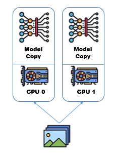
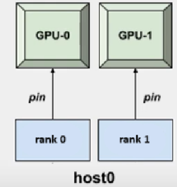
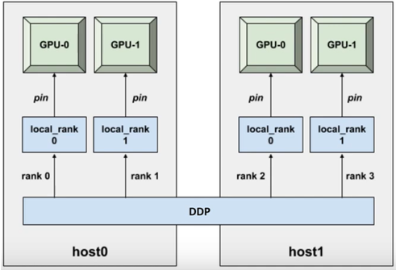

<!--
 t04_scaling_python_workloads.md

 CaSToRC, The Cyprus Institute

 (c) 2024 The Cyprus Institute

 Contributing Authors:
 Spiros Millas (s.millas@cyi.ac.cy)
 Simone Bacchio (s.bacchio@cyi.ac.cy)
 Andreas Athenodorou (a.athenodorou@cyi.ac.cy)
 
 Licensed under the Apache License, Version 2.0 (the "License");
 you may not use this file except in compliance with the License.
 You may obtain a copy of the License at
 
     https://www.apache.org/licenses/LICENSE-2.0
 
 Unless required by applicable law or agreed to in writing, software
 distributed under the License is distributed on an "AS IS" BASIS,
 WITHOUT WARRANTIES OR CONDITIONS OF ANY KIND, either express or implied.
 See the License for the specific language governing permissions and
 limitations under the License.
-->

# 4. Scaling Python Workloads
 
## 4.1. Overview

<div style="text-align: justify;">This tutorial provides a comprehensive guide on scaling Python workloads using Cyclone, covering frameworks for deep learning and hardware acceleration. The tutorial begins by executing Python scripts on CPUs, gradually progressing to single GPU, multi GPU, and multi-node distributed training using PyTorch's Distributed Data Parallel framework. Each section includes modifications to SLURM scripts for resource allocation and Python code adaptations to leverage the targeted hardware configurations. The tutorial concludes with troubleshooting tips and a recap of practices mentioned.</div>

---

## 4.2. Learning Objectives

<div style="text-align: justify;">
By the end of this tutorial, participants will be able to:
<ol>
<li>Write and execute SLURM scripts to run Python scripts on Cyclone in different configurations (CPU, single GPU, multi-GPU, multi-node).</li>
<li>Understand the resource allocation process using SLURM for Python workloads.</li>
<li>Optimize Python workflows for HPC by leveraging distributed computing frameworks like PyTorch DDP.</li>
<li>Troubleshoot common issues when running Python jobs on Cyclone.</li>
</ol>
</div>

---

## 4.3. Prerequisites

1. [T01 - Introduction to HPC Systems](t01_introduction_to_hpc_systems.md): This tutorial will give you some basic knowledge on HPC systems and basic terminologies.


2. [T02 - Accessing and Navigating Cyclone:](t02_accessing_and_navigating_cyclone.md)This tutorial will give you some basic knowledge on how to connect, copy files and navigate the HPC system. 

---

## 4.4. Why Use Cyclone for Python Workloads?
<div style="text-align: justify;">
<ol>
<li><b>Scalability:</b> Using Cyclone, workloads can be scaled across multiple CPUs and GPUs, which enables faster processing of large datasets and complex computations.</li>

<li><b>Performance Gains:</b> Utilizing advanced hardware/software such as GPUs, high-speed interconnects and SLURM, Python workflows can be executed more efficiently.</li>
</div>
</ol>

---

## 4.5. Tools and Frameworks

<div style="text-align: justify;">
<ul>
<li><b>SLURM</b> - Used for job scheduling, job monitoring and environment setup</li>
<li><b>PyTorch</b> - Open-source deep learning framework that’s known for its flexibility and ease-of-use.</li>
<li><b>CUDA</b> - Enables GPU acceleration for computational tasks through APIs to simplify GPU-based parallel processing for HPC, data science and AI.</li>
<li><b>NCCL</b> - Implements multi-GPU and multi-node communication that is optimized for NVIDIA GPUs and networking.</li>
</ul>
</div>

---

## 4.6. Training AI models on Cyclone

<div style="text-align: justify;">This section demonstrates how to run Python scripts with multiple environment configurations on Cyclone, focusing on scaling Python workloads by leveraging Pytorch, CUDA and NVIDIA's NCCL backend.</div>

### 4.6.1. Running Python Scripts on CPU

<div style="text-align: justify;">The script below demonstrates how to sructure a training pipeline for deep learning using PyTorch on a CPU. Firstly, the necessary libraries that handle tasks such as data loading and model training are imported. The main workflow includes downloading the dataset, as well as defining and training a <b>Convolutional Neural Network (CNN)</b>.</div>

```python
import os
import argparse
import torch
import torch.nn as nn
import torch.optim as optim
from torchvision import datasets, transforms
from torch.utils.data import DataLoader
from model import CNN_classifier
import time

def train(model, dataloader: DataLoader, args):

    print("Entering training loop...")
    criterion = nn.NLLLoss()
    optimizer = optim.Adam(params=model.parameters(), lr = args.lr)
    model.train()
    for epoch in range(1, args.epochs + 1):
        epoch_loss: float =  0.0
        for batch_idx, (data,target) in enumerate(dataloader):    
            optimizer.zero_grad()
            output = model(data)
            loss = criterion(output, target)
            loss.backward()
            optimizer.step()
            epoch_loss += loss.item()
            if batch_idx % 100 == 0:
                    print(f'Train Epoch: {epoch} [{batch_idx * len(data)}/{len(dataloader.dataset)} '
                        f'({100. * batch_idx / len(dataloader):.0f}%)]\tLoss: {loss.item():.6f}')
    print("Exiting training loop...")            
    
def main():
    
    parser = argparse.ArgumentParser(prog="Pytorch on HPC")
    parser.add_argument("--batch_size", type=int, default=16)
    parser.add_argument("--epochs", type=int, default=5)
    parser.add_argument("--lr", type=float, default=0.001)
    
    args = parser.parse_args()
    
    transform = transforms.Compose([
    transforms.ToTensor(),
    transforms.Normalize((0.1307,), (0.3081,))
    ])
        
    train_dataset = datasets.MNIST('./data', train=True, download=True, transform=transform)
    train_loader = DataLoader(
        train_dataset,
        batch_size = args.batch_size,
        shuffle=False,
    )
    model = CNN_classifier()
    
    time_start = time.time()
    train(model=model, dataloader= train_loader, args=args)
    time_stop = time.time()
    
    print(f"Training time = {time_stop-time_start}" )
    
if __name__ == "__main__" :
    main()
```

<div style="text-align: justify;">To execute the above script, navigate to 
<code>src/t04</code> and execute the <code>run_cpu.SLURM</code> file using</div>

```bash
sbatch run_cpu.SLURM
```

```bash
#!/bin/bash
#SBATCH --job-name=pytorch_cpu                  # Job name
#SBATCH --nodes=1                               # Number of nodes
#SBATCH --cpus-per-task=10                      # CPUs per task
#SBATCH --time=02:00:00                         # Maximum runtime (HH:MM:SS)
#SBATCH --partition=cpu                         # Partition name
#SBATCH --output=src/t04/logs/cpu_%j.out   # Standard output log
#SBATCH --error=src/t04/logs/cpu_%j.err    # Standard error log

module load PyTorch/1.12.0-foss-2022a-CUDA-11.7.0
module load torchvision/0.13.1-foss-2022a-CUDA-11.7.0

# Run Python script
srun python src/t04/cpu_example.py \
    --batch_size 16 \
    --epochs 5 \
    --lr 0.001
```
The ```run_cpu.SLURM``` script is designed to execute the ```cpu_example.py``` on Cyclone using SLURM. In the script, the number of nodes, CPU cores, runtime and partition are specified, which instruct SLURM to allocate 10 CPU cores from a single node for 2:00:00 hours for this job. 

Next, the environment is setup using Cyclones available modules for Pytorch and Torchvision ensuring all necessary libraries and dependencies are available. 

Finally, the Python script is launched using ```srun```, which executes the specified script with the allocated resources and given runtime arguments.

After executing the above script, two seperate output logs will be generated in the ```logs/``` directory. 

```
cpu_<jobid>.out
cpu_<jobid>.err
```

Navigate to the ```logs/``` directory with the terminal interface using ```cd logs/``` or by using VScode's file explorer.

Next, view the contents of the  ```cpu_<jobid>.out```. To use the terminal, first execute ```module load nano``` to load a Linux text editor and enter the command ```nano cpu_<jobid>.out```. If navigating using VScode, simply double click the output file. 

```python
Entering training loop...
Train Epoch: 1 [0/60000 (0%)]	Loss: 2.300653
Train Epoch: 1 [1600/60000 (3%)]	Loss: 0.546140
.
.
Train Epoch: 5 [57600/60000 (96%)]	Loss: 0.000070
Train Epoch: 5 [59200/60000 (99%)]	Loss: 0.000981
Exiting training loop...
Training time = 192.2544162273407
```

Training this simple CNN classifier for 5 epochs on the relatively small MNIST dataset took a total of 192 seconds. This process can be made significantly more efficient by utilizing Cyclones GPU cores, rather than the CPU cores.

### 4.6.2. Running Python Scripts on Single GPU

To train the AI model using GPUs on Cyclone, some basic modifications must be made on both the Python and SLURM scripts. Beginning with the ```gpu_example.py``` Python script, in the main function, the following code block is added.

```python
 if torch.cuda.is_available():
        print("Utilizing GPU")
        device = torch.device("cuda")
        
    else: 
        print("Utilizing CPU")
        device = torch.device('cpu')
```

The above code initializes the device variable as the GPU, by first checking if there is one available. If not, the device defaults to CPU. 

The next changes to the script must be made before the model begins training using the code below 

```python
model.to(device)
```

and during training using the following 
```python
data = data.to(device)
target = target.to(device)
```
It is important to have both the data and the model on the same device (CPU or GPU), otherwise a runtime error will occur. PyTorch operations require the tensors involved to be on the same device.

The ```run_gpu.SLURM``` script is designed to execute the ```gpu_example.py``` on a single GPU. This configuration is specified by instructing SLURM to allocate a GPU on a single node using the following SLURM directives. When launching gpu jobs on Cyclone, it is important to specify the correct ```--partition``` as SLURM defaults to CPU, which will cause an error.

```bash
#SBATCH --nodes=1                               # Number of nodes
#SBATCH --ntasks-per-node=1                     # Tasks per node (GPUs per node)
#SBATCH --gpus-per-node=1                       # GPUs per node
#SBATCH --partition=gpu                         # Partition name
```
Next, some additional GPU-related modules must be loaded from Cyclone's library. The cuDNN and CUDA modules provide the tools and drivers required to enable GPU optimized deep learning operations.

```bash
module load PyTorch/1.12.0-foss-2022a-CUDA-11.7.0
module load cuDNN/8.4.1.50-CUDA-11.7.0
module load torchvision/0.13.1-foss-2022a-CUDA-11.7.0
module load CUDA/11.7.0
```

When loading modules from Cyclone's library, it is important to load compatible versions of these modules to ensure smooth interaction between the hardware, CUDA, and the deep learning framework (e.g., PyTorch), avoiding errors or performance issues.

To run this SLURM script, navigate to the script directory and submit the job using ```sbatch run_gpu.SLURM```. After the job finishes, navigate to the ```logs/``` directory and open the ```gpu_<job_id>.out``` file and observe the difference.

```python
Utilizing GPU
Entering training loop...
Train Epoch: 1 [0/60000 (0%)]	Loss: 2.332518
Train Epoch: 1 [1600/60000 (3%)]	Loss: 0.376552
Train Epoch: 1 [3200/60000 (5%)]	Loss: 0.127207
.
.
.
Train Epoch: 5 [59200/60000 (99%)]	Loss: 0.082046
Exiting training loop...
Training time = 73.48071932792664
```

Already there is a substantial decrease in training time by utilizing a GPU over a CPU. However, Cyclone offers much more GPU resources per node, meaning that there are further gains to training efficiency left on the table by utilizing only a single GPU.

### 4.6.3. Running Python Scripts on Multi-GPU (Single Node) using DDP

To leverage multiple GPUs per node on Cyclone, workloads must be scaled using parallelization techniques. While there are many times of parallelism, Data parallelism will be used to scale model training in this tutorial. 



When optimizing AI training using data parallelism, a copy model is loaded on all GPUs available, and the dataset is split amongst them. Each GPU processes a different subset of the data in parallel. During the forward pass, each GPU processes a different batch of the data and the gradients are communicated between the devices so as to ensure the model parameters are appropriately updated during backpropagation. To implement this efficiently, PyTorch provides the Distributed Data Parallel (DDP) module, which automates the process of distributing data, synchronizing gradients, and ensuring consistent parameter updates across GPUs. DDP leverages NCCL (NVIDIA Collective Communications Library) as its backend to optimize GPU communication, enabling seamless gradient sharing and synchronization with minimal overhead.



To train our AI model using DDP, some changes must be made to the Python and SLURM scripts. Firstly, the concepts of **Ranks**, **Processes** and the **World** are introduced to the workflow. A rank is the unique id given to a process, and is used for communication purposes. One GPU corresponds to one process. The World is a group that contains all the processes, thus the size of the World is equal to the number of GPUs. 

Firstly, in the ```run_multigpu.SLURM``` script, changes are being made to the directives to instruct SLURM to allocate more GPUs per node. For this section of the tutorial, 2 GPUs on a single node are utilized.   

```bash
#SBATCH --nodes=1                                       # Number of nodes
#SBATCH --ntasks-per-node=2                             # Tasks per node (GPUs per node)
#SBATCH --gpus-per-node=2                               # GPUs per node
```

Further changes to the SLURM script include lines to retrieve environment variables set by the SLURM scheduler to define the nodes' address and a random port which are used to establish communication between processes during training. This communication will be done using the NCCL backend, which must be also loaded. World size can be directly calculated in the SLURM script using the environment variables, which as stated before are the total number of GPUs available. Finally to the srun command, add ```--export=ALL``` to ensure the environment variables are passed to the ```srun``` job

```bash
module load CUDA/11.7.0
module load NCCL/2.12.12-GCCcore-11.3.0-CUDA-11.7.0
module load PyTorch/1.12.0-foss-2022a-CUDA-11.7.0
module load cuDNN/8.4.1.50-CUDA-11.7.0
module load torchvision/0.13.1-foss-2022a-CUDA-11.7.0

export MASTER_ADDR=$(scontrol show hostname $SLURM_NODELIST | head -n 1)
export MASTER_PORT=$(shuf -i 29500-65535 -n 1)
export WORLD_SIZE=$(($SLURM_NNODES * $SLURM_NTASKS_PER_NODE)) 

srun --export=ALL python HPC_tutorial/multigpu_example.py \
    --batch_size 16 \
    --epochs 5 \
    --lr 0.001 \
```

Moving on to the Python script, the environment variables are exported from the SLURM scheduler to be used by DDP, and are placed as global variables at the start of the script, after the import statements.

```python
import os
import argparse
import torch
import torch.nn as nn
import torch.optim as optim
from torchvision import datasets, transforms
from torch.utils.data import DataLoader, DistributedSampler
from model import CNN_classifier
import time

MASTER_ADDR = os.environ["MASTER_ADDR"]
MASTER_PORT = os.environ["MASTER_PORT"]
WORLD_SIZE = int(os.environ["WORLD_SIZE"])
```

The next adjustment to the script happens to the main function (which has been renamed to the worker function). Since SLURM will launch as many processes as there are GPUs, the rank of the process can be defined as the process ID. Next, the process group must be initialized with some key parameters. ```nccl``` is chosen as the backend, the ```world_size``` and ```rank``` parameters are added, and lastly specify the ```init_method = 'env://'``` to indicate the ```MASTER_ADDR``` and ```MASTER_PORT``` environment variables should be used to configure the communication. Finally, the current process is assigned to its corresponding GPU based on its ```rank```. The device object is created with the following syntax ```cuda:<rank>```, which is used send the model and data to the approprate GPU. 

```python
def worker(args): 
   
    rank = int(os.environ["SLURM_PROCID"])    
    
    torch.distributed.init_process_group(
        backend='nccl',
        world_size=WORLD_SIZE,
        rank=rank,
        init_method='env://'

    torch.cuda.set_device(rank)
    device = torch.device(f"cuda:{rank}")

    )
```

When implementing data parallelism, it is unnecessary to download the entire dataset on all devices. One device can download the dataset and share it with the rest of the GPUs. To do this, the dataset download command is changed to only execute on ```rank 0```. To ensure device synchronization, ```torch.distributed.barrier()``` is called, which instructs the GPUs to wait until all other devices reach that same point in the script before continuing. Next the dataset is loaded on all other GPUs

```python
    if rank == 0:        
        train_dataset = datasets.MNIST('./data', 
                                       train=True, 
                                       download=True, 
                                       transform=transform)
    torch.distributed.barrier()
    
    train_dataset = datasets.MNIST('./data', 
                                   train=True, 
                                   download=False, 
                                   transform=transform)
```

Next, a DistributedSampler object is defined, which ensures that workload is distributed across all GPUs that are apart of the world. To ensure the dataset is split into manageable batches, the sampler is combined with the ```Dataloader``` object.

```python
    train_sampler = DistributedSampler(
        train_dataset,
        num_replicas=WORLD_SIZE,
        rank=rank
    )
    
    train_loader = DataLoader(
        train_dataset,
        batch_size=args.batch_size,
        drop_last=True,
        sampler=train_sampler
    )
```

The model is then wrapped with ```DistributedDataParallel```, which will handle the multi-GPU training, ensuring the gradients will be synchronized across all processes after the forward pass. Next, the ```device_ids = [rank]``` is specified to define the GPU on which the model will run for the current process.

```python 
    model = CNN_classifier().to(device)
    model = torch.nn.parallel.DistributedDataParallel(model, device_ids=[rank])
```

Stepping into the ```train()``` function,  ```torch.distributed.barrier()``` is called at the end of the epoch to ensure synchronization during training and to avoid runtime errors. Optionally, rank parameter is added to the function call to avoid duplicate printing in the output call by specifying one GPU to be the logging device. 

```python
def train(model, dataloader: DataLoader, args, device,rank):
    criterion = nn.NLLLoss()
    optimizer = optim.Adam(params=model.parameters(), lr = args.lr)
    model.train()
    if rank == 0:    
        print("Entering training loop...")
    for epoch in range(1, args.epochs + 1):
        epoch_loss: float =  0.0
        for batch_idx, (data,target) in enumerate(dataloader):
            data = data.to(device)
            target = target.to(device)
            output = model(data)
            loss = criterion(output, target)
            optimizer.zero_grad()
            loss.backward()
            optimizer.step()
            epoch_loss += loss.item() #monitoring
            if rank == 0 and batch_idx % 100 == 0:
                    print(f'Train Epoch: {epoch} [{batch_idx * len(data)}/{len(dataloader.dataset)} '
                        f'({100. * batch_idx / len(dataloader):.0f}%)]\tLoss: {loss.item():.6f}')
        
        torch.distributed.barrier()
    if rank == 0:    
        print("Exiting training loop...")            
    
```

Last and most importantly, at the end of the worker function, ```   torch.distributed.destroy_process_group()``` is called. This ensures all resources tied to distributed training are properly released.

```python
    if rank == 0:
        print(f"Training time = {time_stop - time_start}")
        
    torch.distributed.destroy_process_group()
    
if __name__ == "__main__" :
   worker(args=args)
```

To execute this script, navigate to the ```scr/t04/``` directory and submit a job using ```sbatch scr/t04/run_multigpu.SLURM```. After the job completes, navigate to the ```logs/``` directory, open the ```multigpu_<job_id>.out``` and observe the changes.

```python
MASTER_ADDR: gpu06
MASTER_PORT: 31315
WORLD_SIZE: 2
Entering training loop...
Train Epoch: 1 [0/60000 (0%)]	Loss: 2.319880
.
.
.
Train Epoch: 5 [27200/60000 (91%)]	Loss: 0.000118
Train Epoch: 5 [28800/60000 (96%)]	Loss: 0.000066
Exiting training loop...
Training time = 42.064579248428345
```

By utilizing multiple GPUs, we achieve a much faster training time. Cyclone offers 4 GPUs per node. But multiple nodes can be used to further speed up training with minimal changes to the code base.

### 4.6.4. Running Python Scripts on Multi-GPU (Multi-Node) with DDP

Using the same parallelization technique and some simple changes to the SLURM and Python scripts, more compute resources can be leveraged to further speed up the AI models' training by utilizing multiple nodes.

To do this, some changes must first be made to the SLURM script. These changes instruct the SLURM scheduler to allocate two GPUs on two nodes, for a total of four GPUs.

```python
#SBATCH --nodes=2                                       # Number of nodes
#SBATCH --ntasks-per-node=2                             # Tasks per node (GPUs per node)
#SBATCH --gpus-per-node=2   
```

Next change is the addition of the ```NODE_RANK``` environment variable which will equal the unique identifier of the current node in the distributed setup.

```python
export MASTER_ADDR=$(scontrol show hostname $SLURM_NODELIST | head -n 1)
export MASTER_PORT=$(shuf -i 29500-65535 -n 1)

export WORLD_SIZE=$(($SLURM_NNODES * $SLURM_NTASKS_PER_NODE))
export NODE_RANK=$SLURM_NODEID
```

In the python script, the first change that must be made is the addition of the ```NODE_RANK``` global variable, which will be used in the worker function for logging purposes. 

```python
MASTER_ADDR = os.environ["MASTER_ADDR"]
MASTER_PORT = os.environ["MASTER_PORT"]
WORLD_SIZE = int(os.environ["WORLD_SIZE"])
NODE_RANK = int(os.environ["NODE_RANK"])
```

In the worker function, the concepts of ```local_rank``` and ```global_rank``` are introduced and defined using the SLURM scheduler environment variables.

```python
global_rank = int(os.environ["SLURM_PROCID"])    
local_rank = int(os.environ["SLURM_LOCALID"])
```

The  ```global_rank``` is the unique identity assigned to each process (GPU) as apart of the general ```world``` and is used for inter-process communication and coordination across the entire cluster. The ```local_rank``` is the unique identifier assigned to a process as a part of a node and is used to assign and manage GPU usage within a specific node in DDP.



Moving on, a few changes must be made to the rank assignment on the various function calls. In the ```torch.distributed.init_process_group()``` the ```global_rank``` is used to uniquely identify each process in the distributed training across all nodes. It ensures proper coordination and communication in the entire distributed world.

```python
torch.distributed.init_process_group(
    backend='nccl', 
    world_size=WORLD_SIZE, 
    rank=global_rank,
    init_method='env://'
)
```

Next, when setting the device, the ```local_rank``` is used to specify which GPU on the current node the process will use. Each process must operate on a separate GPU within the same node.

```python
torch.cuda.set_device(local_rank)
device = torch.device(f"cuda:{local_rank}")
```

Afterwards, When downloading the dataset, ```local_rank``` is used to share the dataset with all other GPUs on the same node

```python
 if local_rank == 0:
        train_dataset = datasets.MNIST('./data',
                       train=True, 
                       download=True, 
                       transform=transform)
```

Furthermore, when wrapping the model with DDP, The local_rank is used to bind the DDP instance to the specific GPU that the process is operating on, ensuring the process handles only its assigned device.

```python
model = nn.parallel.DistributedDataParallel(model, device_ids=[local_rank])
```

Lastly, when logging during training, the ```global_rank``` is used to avoid redundant log statements in the output.

```python
train(model=model, dataloader=train_loader, args=args, device=device, rank=global_rank)
```

To run this script and leverage multiple nodes on Cyclone, navigate to the ```src/t04/``` directory and launch the ```run_multinode.SLURM``` script. Wait until the job finishes, navigate to the ```logs/``` directory, open the ```multinode_<job_id>.out``` file and observe the results.

```python
MASTER_ADDR: gpu06
MASTER_PORT: 57049
WORLD_SIZE: 4
NODE_RANK: 0
Rank 1 on Node 0: Initializing process group.
Rank 3 on Node 1: Initializing process group.
Rank 2 on Node 1: Initializing process group.
Rank 0 on Node 0: Initializing process group.
Entering training loop...
.
.
.
Train Epoch: 5 [12800/60000 (85%)]	Loss: 0.000021
Train Epoch: 5 [14400/60000 (96%)]	Loss: 0.000576
Exiting training loop...
Training time = 25.612423181533813
```

---

## 4.7. Recap and Troubleshooting

In this tutorial, we covered the process of scaling Python workloads on Cyclone, focusing on the following key concepts:

<ol>
<li><b>Resource Allocation with SLURM</b>
    <ul>
    <li>Setting up SLURM directives for various configurations, from single CPU to multi-node GPU training.</li>
    <li>Using environment variables such as MASTER_ADDR, MASTER_PORT, and WORLD_SIZE for distributed computing.</li>
    </ul>
</li>
<li><b>Python Script Modifications</b>
    <ul>
    <li>Adapting scripts for different hardware configurations (CPU, single GPU, multi-GPU, and multi-node setups).</li>
    <li>Leveraging DistributedDataParallel to automate data parallelism across GPUs.</li>
    </ul>
</ol>

While Using Cyclone for distributed training and complex computations, some issues may be encountered with regards to job submission or ```RuntimeErrors```

<ol>
<li><b>SLURM job fails to launch</b>
    <ul>
    <li><b>Problem:</b> SLURM job fails with an error indicating incorrect directives.
        <ul>
        <li><b>Solution:</b> Double-check SLURM script parameters (<code>--nodes</code>, <code>--gpus-per-node</code>, <code>--partition</code>). Ensure they match the resources available in the partition.</li>
        </ul>
    </li>
    </ul>
</li>
<li><b>Runtime errors</b>
    <ul>
    <li><b>Problem:</b> Tensor or model mismatch errors during training.
        <ul>
        <li><b>Solution:</b> Ensure both the model and data tensors are moved to the correct device using <code>model.to(device)</code> and <code>data.to(device)</code>.</li>
        </ul>
    </li>
    </ul>
    <ul>
    <li><b>Problem:</b> Processes fail to communicate due to incorrect master address or port.
        <ul>
        <li><b>Solution:</b> Verify that <code>MASTER_ADDR</code> and <code>MASTER_PORT</code> are correctly set in the SLURM script and ensure network connectivity between nodes.</li>
        </ul>
    </li>
    </ul>
    <ul>
    <li><b>Problem:</b> Training does not scale as expected.
        <ul>
        <li><b>Solution:</b> Ensure efficient resource utilization by setting appropriate batch sizes and verifying GPU utilization using monitoring tools (e.g., <code>nvidia-smi</code>).</li>
        </ul>
    </li>
    </ul>
</li>
</ol>

---
