<!--
 t06_interactive_computing_with_jupyter_notebooks.md

 CaSToRC, The Cyprus Institute

 (c) 2024 The Cyprus Institute

 Contributing Authors:
 Giorgos Kosta (g.kosta@cyi.ac.cy)
 Marios Constantinou (mar.constantinou@cyi.ac.cy)
 Emmanouil Kritikos (e.kritikos@cyi.ac.cy)
 Leonidas Christodoulou (l.christodoulou@cyi.ac.cy)
 
 Licensed under the Apache License, Version 2.0 (the "License");
 you may not use this file except in compliance with the License.
 You may obtain a copy of the License at
 
     https://www.apache.org/licenses/LICENSE-2.0
 
 Unless required by applicable law or agreed to in writing, software
 distributed under the License is distributed on an "AS IS" BASIS,
 WITHOUT WARRANTIES OR CONDITIONS OF ANY KIND, either express or implied.
 See the License for the specific language governing permissions and
 limitations under the License.
-->

# 6. Interactive Computing on Cyclone with Jupyter Notebooks

## 6.1 Overview
This tutorial introduces participants to running Jupyter Notebooks directly on Cyclone’s compute nodes, enabling interactive workflows for data analysis, AI model development, and other computational tasks. Participants will gain an understanding of the benefits of using Jupyter Notebooks in an HPC environment and learn the step-by-step process to launch and access them. By the end of the tutorial, users will be equipped with the knowledge to set up and interact with Jupyter Notebooks efficiently on Cyclone.

---

## 6.2 Learning Objectives
By the end of this tutorial, participants will be able to:

1. Understand the advantages of using Jupyter Notebooks on HPC systems for interactive computing.

2. Follow the steps to configure and launch Jupyter Notebooks on Cyclone’s compute nodes.

3. Establish secure SSH tunnels to access notebooks from a local browser.

4. Optimize resource allocation for Jupyter Notebook sessions using SLURM scripts.

---
## 6.3 Prerequisites
- [Accessing and Navigating Cyclone](https://github.com/CaSToRC-CyI/eurocc2_cyclone_tutorials/blob/t03/tutorials/t02_accessing_and_navigating_cyclone.md). This tutorial will give you some basic knowledge on how to connect, copy files and navigate the HPC system
- [Setting Up and Using Development Tools](https://github.com/CaSToRC-CyI/eurocc2_cyclone_tutorials/blob/t03/tutorials/t03_setting_up_and_using_development_tools.md) This tutorial will guide you through creating python environments which will be used as notebook kernels throughout this Tutorial

---

## 6.4 Detailed steps

### 6.4.1. Connect to Cyclone:

First, establish a connection to Cyclone using SSH:
```bash
ssh username@cyclone.hpcf.ac.cy
```

> 💡 **Tip**: Replace `username` with your actual Cyclone username. If you encounter connection issues, refer back to the [Accessing and Navigating Cyclone](https://github.com/CaSToRC-CyI/eurocc2_cyclone_tutorials/blob/t03/tutorials/t02_accessing_and_navigating_cyclone.md) tutorial from the beginning.

### 6.4.2.  Create an environment with the necessary dependencies:

During these steps you might see this in your terminal:
```bash
Proceed ([y]/n)?
```
Just type the letter y and then press Enter to continue.


#### Step 1: Create a simple conda environment

```bash
module load Anaconda3
conda create --name notebookEnv
```
Your terminal should look something like this 

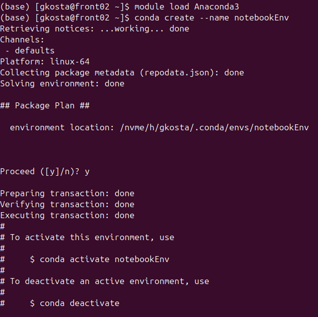

#### Step 2: Activate your environment

```bash
conda activate notebookEnv
```
You should see the name of the environment before your username now:

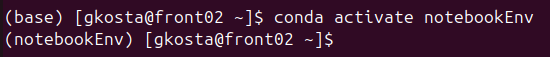

#### Step 3: Install necessary dependencies

```bash
conda install -c conda-forge notebook
```
> ⚠️ **Note**: This installation might take a few minutes. Be patient and don't interrupt the process.

When this command finishes, your terminal should look something like this:

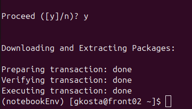

## 6.5. Launching Jupyter on a Compute Node
We'll use a pre-configured [Slurm script](../src/t06/launch_notebook.sh) to launch our Jupyter server. Let's break down the key components: 

#### Step 1: We setup the basic slurm environment variables so our job can be submitted using `sbatch`:
```bash
#!/bin/bash -l

#SBATCH --job-name=jupyter_test
#SBATCH --partition=gpu # Partition
#SBATCH --nodes=1 # Number of nodes
#SBATCH --gres=gpu:1 # Number of GPUs
#SBATCH --ntasks-per-node=1  # Number of tasks
#SBATCH --cpus-per-task=10 # Number of cpu cores
#SBATCH --mem=20G #Total memory per node
#SBATCH --output=job.%j.out # Stdout (%j=jobId)
#SBATCH --error=job.%j.err # Stderr (%j=jobId)
#SBATCH --time=1:00:00 # Walltime
#SBATCH --reservation=short # Walltime
#SBATCH -A p166 # Accounting project

```
In this instance, we're requesting resources 
- From 1 Node (--nodes=1) in the gpu partition (--partition=gpu) with:
    - 1 gpu (--gres=gpu:1)
    - 1 hour (--time=1:00:00)
    - 20GB of RAM (--mem=20G)
    - 10 cpu cores. (--cpus-per-task=10)

We named the job name jupyter_test and our usage will be deducted from the p166 project.

Then the actual script that's going to run on the compute node starts.
This configuration requests:
- 1 GPU node
- 10 CPU cores
- 1 hour of compute time
- Resources from project p166

#### Step 2: We load the Anaconda3 module and activate our environment excatly like we did in section 2:

```bash
# Load any necessary modules and activate environment
module load Anaconda3

conda activate notebookEnv

```

#### Step 3: Configure the jupyter server

This piece of the slurm script initialises some basic variables so we can securely connect to our jupyter server:

```bash
# Add our environment as a notebook kernel
python -m ipykernel install --user --name=notebookEnv

# Compute node hostname
HOSTNAME=$(hostname)

# Generate random ports for Jupyter
JUPYTER_PORT=$(shuf -i 10000-60000 -n 1)

# Generate a random password for Jupyter Notebook
PASSWORD=$(openssl rand -base64 12)

# Hash the password using Jupyter's built-in function
HASHED_PASSWORD=$(python -c "from jupyter_server.auth import passwd; print(passwd('$PASSWORD'))")

```
Let's look at it step by step:

We start by adding our environment as a notebook kernel. This is done so we can effieciently manage our python packages. You can add more environments for different use cases. For example you can have a conda environment for pytorch and one for tensorflow.
```bash
# Add our environment as a notebook kernel
python -m ipykernel install --user --name=notebookEnv
```

Then we retrieve the hostname or IP of the compute node:
```bash
# Compute node hostname
HOSTNAME=$(hostname)
```

Generate random port numbers so we're less likely to use an already used port.

```bash
# Generate random ports for Jupyter
JUPYTER_PORT=$(shuf -i 10000-60000 -n 1)
```

Generate a random password to avoid unauthorised usage of your jupyter server and HPC resources"

```bash
# Generate a random password for Jupyter Notebook
PASSWORD=$(openssl rand -base64 12)

# Hash the password using Jupyter's built-in function
HASHED_PASSWORD=$(python -c "from jupyter_server.auth import passwd; print(passwd('$PASSWORD'))")
```

#### Step 4: Launching the jupyter server

We launch the jupyter server with the variables we just generated. Feel free to change the `--notebook-dir` option to point at whatever directory you want.
```bash
# Run Jupyter notebook
jupyter notebook --port=$JUPYTER_PORT --NotebookApp.password="$HASHED_PASSWORD" --notebook-dir="$HOME" --no-browser > jupyter.log 2>&1 &
```
The jupyter command generates a blocking process, meaning it keeps control of our bash session until we end that process. So we redirect it's output to the `jupyter.log` file and leave it running as a background process.

#### Step 5: Automatically generating the necessary connection commands

Since we want to connect from our personal machine, laptop for example, to the jupyter server running on the compute node, we'll need an SSH tunnel. This tunnel will first create a jump connection from the front node to our assigned compute node, and then bind the port our server is running to our local machine's port. We've prepared a script which automatically generates this command for you:

```bash
LOGIN_HOST="cyclone.hpcf.cyi.ac.cy"


# Prepare the message to be displayed and saved to a file
CONNECTION_MESSAGE=$(cat <<EOF
==================================================================
Run this command to connect on your jupyter notebooks remotely
ssh -N -J ${USER}@${LOGIN_HOST} ${USER}@${HOSTNAME} -L ${JUPYTER_PORT}:localhost:${JUPYTER_PORT}


Jupyter Notebook is running at: http://localhost:$JUPYTER_PORT
Password to access the notebook: $PASSWORD
==================================================================
EOF
)

# Print the connection details to both the terminal and a txt file
echo "$CONNECTION_MESSAGE" | tee ~/connection_info.txt

wait
```
---
[Here](../utils/launch_notebook.sh) is the complete script for your convenience:

```bash
#!/bin/bash -l

#SBATCH --job-name=jupyter_test
#SBATCH --partition=gpu # Partition
#SBATCH --nodes=1 # Number of nodes
#SBATCH --gres=gpu:1 # Number of GPUs
#SBATCH --ntasks-per-node=1  # Number of tasks
#SBATCH --cpus-per-task=10 # Number of cpu cores
#SBATCH --mem=20G #Total memory per node
#SBATCH --output=job.%j.out # Stdout (%j=jobId)
#SBATCH --error=job.%j.err # Stderr (%j=jobId)
#SBATCH --time=1:00:00 # Walltime
#SBATCH --reservation=short # Walltime
#SBATCH -A p166 # Accounting project


# Load any necessary modules and activate environment
module load Anaconda3

conda activate notebookEnv

# Add our environment as a notebook kernel
python -m ipykernel install --user --name=notebookEnv

# Compute node hostname
HOSTNAME=$(hostname)

# Generate random ports for Jupyter
JUPYTER_PORT=$(shuf -i 10000-60000 -n 1)

# Generate a random password for Jupyter Notebook
PASSWORD=$(openssl rand -base64 12)

# Hash the password using Jupyter's built-in function
HASHED_PASSWORD=$(python -c "from jupyter_server.auth import passwd; print(passwd('$PASSWORD'))")


# Run Jupyter notebook
jupyter notebook --port=$JUPYTER_PORT --NotebookApp.password="$HASHED_PASSWORD" --notebook-dir="$HOME" --no-browser > jupyter.log 2>&1 &

sleep 5


LOGIN_HOST="cyclone.hpcf.cyi.ac.cy"


# Prepare the message to be displayed and saved to a file
CONNECTION_MESSAGE=$(cat <<EOF
==================================================================
Run this command to connect on your jupyter notebooks remotely
ssh -N -J ${USER}@${LOGIN_HOST} ${USER}@${HOSTNAME} -L ${JUPYTER_PORT}:localhost:${JUPYTER_PORT}


Jupyter Notebook is running at: http://localhost:$JUPYTER_PORT
Password to access the notebook: $PASSWORD
==================================================================
EOF
)

# Print the connection details to both the terminal and a txt file
echo "$CONNECTION_MESSAGE" | tee ~/connection_info.txt

wait
```

#### Step 6:

Now that everything is configured, let's submit this slurm script and see what it does.


After successfully connecting to Cyclone through ssh, use this command:
```bash
sbatch utils/launch_notebook.sh
```
> You might need to change the directory after `sbatch`. This example assumes you're in the root directory of this repository.

You should see something like this in your terminal after using `sbatch`:
```bash
Submitted batch job 1034638
```
In this instance `1034638` is your job id. To view the status of your job you can use the `squeue` command:
```bash
squeue -u $USER
```
The output will look like this:

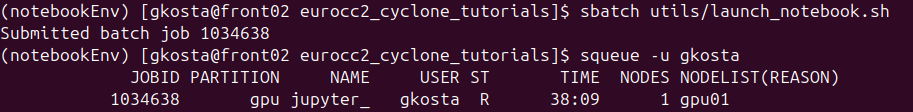

Under the ST column you can see the status of your job. In this case R means it's running. If you see CF then it means your node is in its configuration state, waiting 5 minutes should be enough for it to get ready and your have your job running. If you see PD then it means your job is Pending resource allocation, meaning there aren't enough resources and your job has been placed on a queue.

When you're sure your job is running, you should also see some new files generated in your directory. 

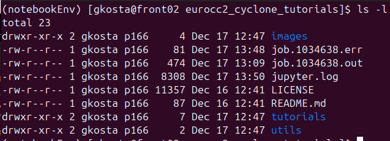

- `job.1034638.out` is your jobs stdout
- `job.1034638.err` is your jobs stderr
- `jupyter.log` is your jupyter server log output

Unless you are debugging something these shouldn't concern you.

## 6.6. Connect to your jupyter server

We'll look at two different options on how you can use notebooks running on the now running jupyter server.
- Browser
- VSCode

Before we do that though, we need to create the SSH tunnel we mentioned in the previous section. The connection info was stored in a text file in your home directory with the name `connection_info.txt`. To view its content you can use your VSCode editor if you're following from [Tutorial 03: Setting up and using development tools](t03_setting_up_and_using_development_tools.md), or simply use the `cat` command:

```bash
cat ~/connection_info.txt
```
The output will look something like:

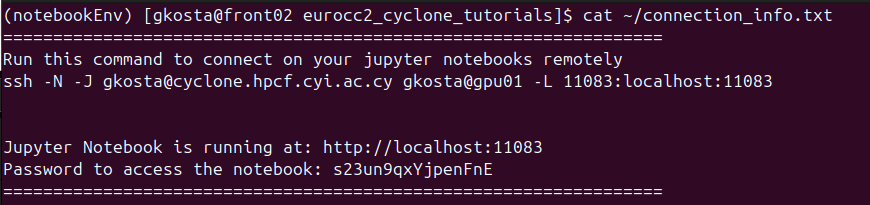

**Important: The SSH command should be run on a fresh local terminal! Not already connected to cyclone**

The ssh command is blocking, meaning nothing will be printed when it's run. You may be prompted for your key's passphrase.

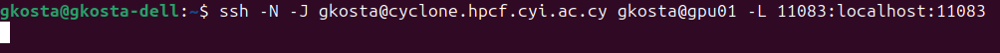    ```

### 6.6.1 Browser
With the SSH tunnel running, our local machine now is now connected to the compute node via the port `11083` in the above example. To launch the jupyter notebook in a browser, just head to the link printed from `connection_info.txt`, in our case it's http://localhost:11083.

You should reach a page asking for the password looking like this:


Once we input the password from `connection_info.txt`, in our case `s23un9qxYjpenFnE`, and press the Log In button, we're in!

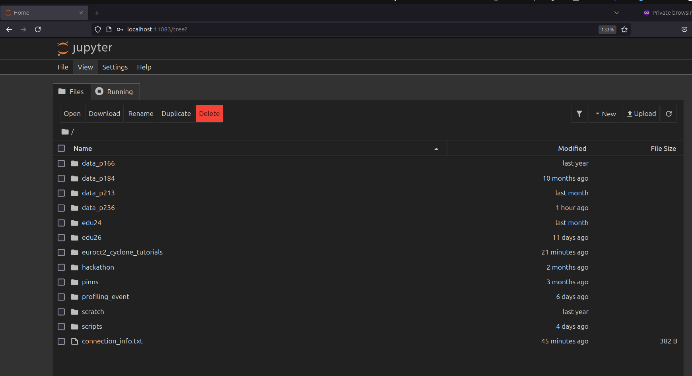


Let's create a new notebook! Click the New button


Now we can see serveral options:
- Notebook kernels - Both kernels have the same python interpreter, the one in our conda environment.
    - Python 3 (ipykernel) - Default Python kernel 
    - notebookEnv - Our custom kernel we added

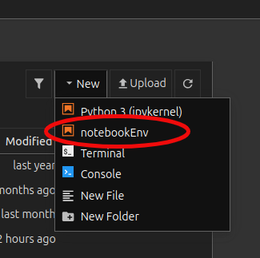

- Terminal - Launches a terminal session on the compute node, you can use this for running `htop` or `nvidia-smi` to view hardware utilisation
- Console - Launches a python interactive shell 
- New File - Create a new file, this might be a text file, a python script or whatever you want.
- New Folder - Create a new folder

If you click on any of the python kernel options, in this case notebookEnv, a new tab in your browser will open with a notebook:

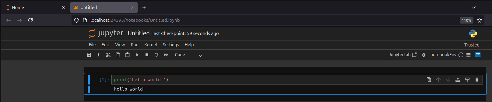 


### 6.6.2. VSCode

To view and run notebooks in VSCode we need to have some extentions installed. Searching `jupyter` in the extensions tab of VSCode should show you something like this:

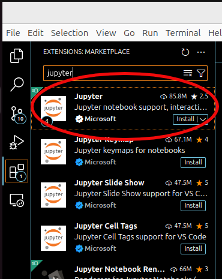

Click install on the one circled and wait for it to be installed. Once that's done, open a folder on your local machine:

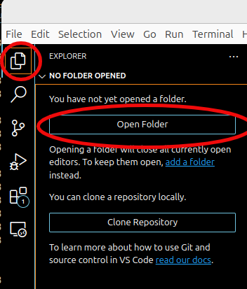

For this example we used this repo:

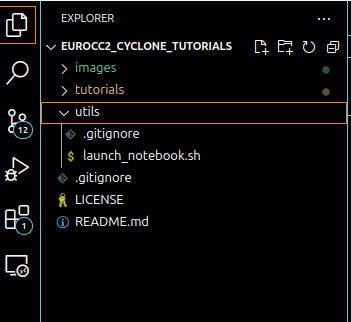

Right click inside a folder:

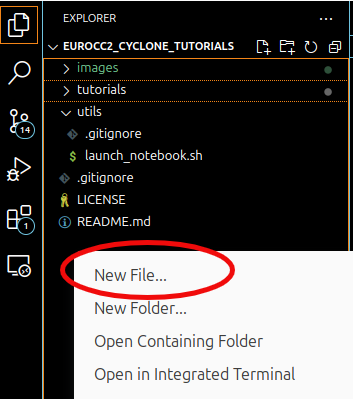

Make sure to add the `.ipyng` extention at the end!

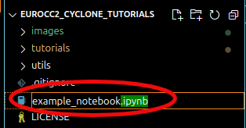

Now the notebook should be open in your VSCode window. You are now ready to connect this notebook to the jupyter server running on the compute node. We do this by selecting a remote server by pressing the Select Kernel button at the top right of your screen:


Then you will see this in the top middle of your screen:

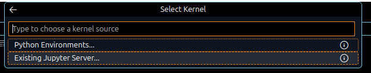

Select "Existing Jupyter Server.."

Add the link that's inside your `connection_info.txt`

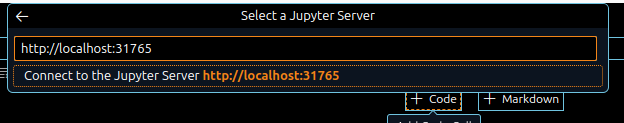

Add the password, again found inside the `connection_info.txt`


And finally a display name for your connection, this can be anything you want:


Select the appropriate kernel:

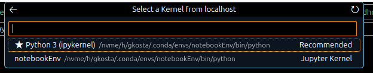

That's it. Now your notebook is running remotely on the compute node!
Adding a couple of cells and calling nvidia-smi shows us the 1 gpu running on gpu01:

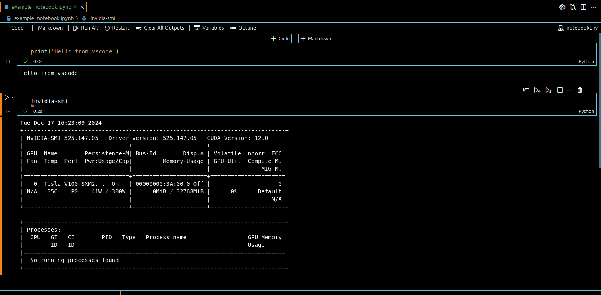

--- 

## 6.7. Troubleshooting the SSH tunnel:
### 6.7.1. Port Conflicts

**Symptom 1:** Error message "Address already in use" or unable to connect to the specified port
Solutions:

- Check if the port is already in use:
    ```bash
    lsof -i :PORT_NUMBER     # On your local machine
    ```
- Kill any existing SSH tunnels:

    ```bash
    pkill -f "ssh -N -J"
    ```


### 6.7.2. Authentication issues
**Symptom 2:** SSH key authentication failures
Solutions:

- Verify your SSH key is properly added to Cyclone:
    ```bash
    ssh-add -l               # List loaded keys
    ssh-add ~/.ssh/id_rsa    # Add your key if needed
    ```
- Check key permissions:
    ```bash
    chmod 600 ~/.ssh/id_rsa
    chmod 700 ~/.ssh


### 6.7.3. General Debugging Tips

- Check the job output files for errors:
    ```bash
    cat job.[jobid].out
    cat job.[jobid].err
    ```
    > Replace `[jobid]` with the your Job ID

    These commands will print out the contents of the outputs of the job. They might contain some more information that will guide you to find the problem. Some examples:
        
    - The conda environment name might be wrong.
    - Package dependency issues inside your conda environment.
    - The project you're requesting resources from might not have access to the partition you requested.


