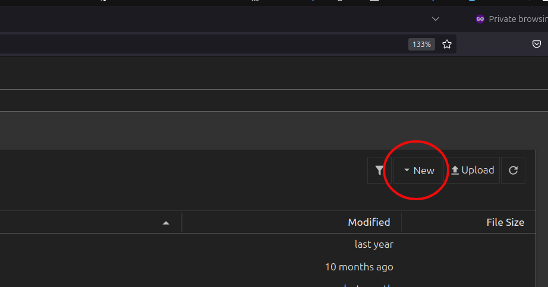
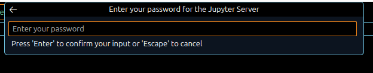
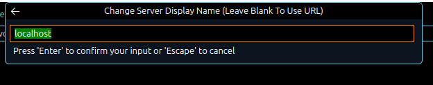

<!--
 t06_interactive_computing_with_jupyter_notebooks.md

 CaSToRC, The Cyprus Institute

 (c) 2024 The Cyprus Institute

 Contributing Authors:
 Giorgos Kosta (g.kosta@cyi.ac.cy)
 Marios Constantinou (mar.constantinou@cyi.ac.cy)
 Emmanouil Kritikos (e.kritikos@cyi.ac.cy)
 Leonidas Christodoulou (l.christodoulou@cyi.ac.cy)
 
 Licensed under the Apache License, Version 2.0 (the "License");
 you may not use this file except in compliance with the License.
 You may obtain a copy of the License at
 
     https://www.apache.org/licenses/LICENSE-2.0
 
 Unless required by applicable law or agreed to in writing, software
 distributed under the License is distributed on an "AS IS" BASIS,
 WITHOUT WARRANTIES OR CONDITIONS OF ANY KIND, either express or implied.
 See the License for the specific language governing permissions and
 limitations under the License.
-->

# 6. Interactive Computing on Cyclone with Jupyter Notebooks

## 6.1. Overview
<div style="text-align: justify; margin-bottom: 15px;">
This tutorial introduces participants to <b><i>running Jupyter Notebooks directly on Cyclone’s compute nodes</i></b>, enabling interactive workflows for data analysis, AI model development, and other computational tasks. Participants will gain an understanding of the benefits of using Jupyter Notebooks in an HPC environment and learn the <b><i>step-by-step process to launch and access them</i></b>. By the end of the tutorial, users will be equipped with the knowledge to set up and interact with Jupyter Notebooks efficiently on Cyclone.
</div>

### 6.1.1. Why Jupyter Notebooks on HPC?

<div style="text-align: justify; margin-bottom: 15px;">
Jupyter Notebooks offer a highly interactive environment that seamlessly combines code execution, visualizations, and narrative explanations, making them ideal for tasks like data exploration, visualization, and AI model development. Their intuitive, web-based interface simplifies complex workflows, lowering the learning curve for users across various expertise levels.
</div>

<div style="text-align: justify; margin-bottom: 15px;">
Leveraging Jupyter Notebooks on HPC systems amplifies these benefits by providing access to powerful compute resources, such as CPUs and GPUs, that can handle large-scale datasets and perform demanding AI training or numerical simulations. This integration enables users to work interactively and efficiently, tackling computational challenges beyond the capabilities of local machines.
</div>

---

## 6.2. Learning Objectives
<div style="text-align: justify; margin-bottom: 15px;">
By the end of this tutorial, participants will be able to:
<ol>
<li>Understand the advantages of using Jupyter Notebooks on HPC systems for interactive computing.</li>
<li>Follow the steps to configure and launch Jupyter Notebooks on Cyclone’s compute nodes.</li>
<li>Establish secure SSH tunnels to access notebooks from a local browser.</li>
<li>Optimize resource allocation for Jupyter Notebook sessions using SLURM scripts.</li>
</ol>
</div>

---

## 6.3. Prerequisites

1. [T01 - Introduction to HPC Systems](t01_introduction_to_hpc_systems.md): This tutorial will give you some basic knowledge on HPC systems and basic terminologies.


2. [T02 - Accessing and Navigating Cyclone:](t02_accessing_and_navigating_cyclone.md)This tutorial will give you some basic knowledge on how to connect, copy files and navigate the HPC system. 

---

## 6.4. Workflow Steps
<div style="text-align: justify; margin-bottom: 15px;">
Running Jupyter Notebooks on an HPC system involves allocating resources using a SLURM script and establishing a secure connection to access the notebook interface in your local browser, or VS Studio.
</div>

<div style="text-align: justify; margin-bottom: 15px;">
To launch and access a notebook from Cyclone's compute nodes, the following workflow must be followed:
<ol>
<li><b>Create a Clean Environment:</b> Create a clean <code>conda</code> environment with Jupyter Notebook and relevant dependencies.
<li><b>Write a SLURM Script:</b> Create a SLURM job script specifying the resources required for your Jupyter session, such as CPUs, memory, or GPUs.</li>
<li><b>Submit the Script:</b> Use the sbatch command to submit the script to the HPC scheduler, which will allocate the requested resources and launch the Jupyter Notebook server.</li>
<li><b>Create an SSH Tunnel:</b> Establish a secure SSH tunnel to forward the notebook's port from the remote HPC system to your local machine, enabling browser access.</li>
<li><b>Open the Notebook:</b> Use the forwarded port to access the Jupyter Notebook interface in your web browser, enabling an interactive and powerful environment for your tasks.</li>
</ol>
</div>

---

## 6.5. Initial Setup

<div style="text-align: justify; margin-bottom: 15px;">
First, establish a connection to Cyclone using SSH:
</div>

```bash
ssh username@cyclone.hpcf.ac.cy
```

<div style="text-align: justify; margin-bottom: 15px;">
<blockquote>
<i>⚠️ Replace <code>username</code> with your actual Cyclone username. If you encounter connection issues, refer back to <a href="../t02_accessing_and_navigating_cyclone">Tutorial 02 - Accessing and Navigating Cyclone</a>.</i>
</blockquote>
</div>

<div style="text-align: justify; margin-bottom: 15px;">
Next, create an environment with the necessary dependencies.
</div>

<div style="text-align: justify; margin-bottom: 15px;">
<blockquote>
<i>⚠️ During these steps you might see this in your terminal:

```bash
Proceed ([y]/n)?
```

Just type the letter y and then press Enter to continue.</i>
</blockquote>
</div>

<div style="text-align: justify; margin-bottom: 15px;">
First, create a simple <code>conda</code> environment
</div>

```bash
module load Anaconda3
conda create --name notebookEnv
```

<div style="text-align: justify; margin-bottom: 15px;">
Your terminal should look something like this 
</div>

```bash
(base) [gkosta@front02 ~]$ module load Anaconda3
(base) [gkosta@front02 ~]$ conda create --name notebookEnv
Retrieving notices: ...working... done
Channels:
 - defaults
Platform: linux-64
Collecting package metadata (repodata.json): done
Solving environment: done

## Package Plan ##

    environment location: /nvme/h/gkosta/.conda/envs/notebookEnv


Proceed ([y]/n)? y

Preparing transaction: done
Verifying transaction: done
Executing transaction: done
#
# To activate this environment, use
#
#     $ conda activate notebookEnv
#
# To deactivate an active environment, use
#
#     $ conda deactivate
```

<div style="text-align: justify; margin-bottom: 15px;">
To activate the environment, type
</div>

```bash
conda activate notebookEnv
```

<div style="text-align: justify; margin-bottom: 15px;">
You should now see the name of the environment before your username:
</div>

```bash
(base) [gkosta@front02 ~]$ conda activate notebookEnv
(notebookEnv) [gkosta@front02 ~]$
```

<div style="text-align: justify; margin-bottom: 15px;">
Once you activate the environment, to install the dependencies required by Jupyter notebook run the following:
</div>

```bash
(notebookEnv) [gkosta@front02 ~]$ conda install -c conda-forge notebook
Proceed ([y]/n)? y

Downloading and Extracting Packages:

Preparing transaction: done
Verifying transaction: done
Executing transaction: done
```

<div style="text-align: justify; margin-bottom: 15px;">
<blockquote>
<i> ⚠️ This installation might take a few minutes. Be patient and don't interrupt the process.</i>
</blockquote>
</div>

---

## 6.5. Launching Jupyter on a Compute Node

<div style="text-align: justify; margin-bottom: 15px;">
We'll use a pre-configured <a href="../../src/t06/launch_notebook.sh">Slurm script</a> to launch our Jupyter server. Let's break down the key components:
</div>

#### Step 1: Slurm Environment Setup

<div style="text-align: justify; margin-bottom: 15px;">
We first setup the basic slurm environment variables so our job can be submitted using <code>sbatch</code>:
</div>

```bash
#!/bin/bash -l

#SBATCH --job-name=jupyter_test
#SBATCH --partition=gpu             # Partition
#SBATCH --nodes=1                   # Number of nodes
#SBATCH --gres=gpu:1                # Number of GPUs
#SBATCH --ntasks-per-node=1         # Number of tasks
#SBATCH --cpus-per-task=10          # Number of cpu cores
#SBATCH --mem=20G                   # Total memory per node
#SBATCH --output=job.%j.out         # Stdout (%j=jobId)
#SBATCH --error=job.%j.err          # Stderr (%j=jobId)
#SBATCH --time=1:00:00              # Walltime
#SBATCH -A <your_project_id>        # Accounting project

```

<div style="text-align: justify; margin-bottom: 15px;">
In this instance, we're requesting resources from 1 Node (<code>--nodes=1</code>) in the GPU partition (<code>--partition=gpu</code>) with:
<ul>
<li>1 GPU (<code>--gres=gpu:1</code>)</li>
<li>1 hour (<code>--time=1:00:00</code>)</li>
<li>20GB of RAM (<code>--mem=20G</code>)</li>
<li>10 CPU cores. (<code>--cpus-per-task=10</code>)</li>
</ul>
</div>

<div style="text-align: justify; margin-bottom: 15px;">
The job name is <code>jupyter_test</code> and the usage will be deducted from account <code>your_project_id</code>.
</div>

<div style="text-align: justify; margin-bottom: 15px;">
<blockquote>
<i>⚠️ Remember to replace <code>your_project_id</code> with your allocated project budget.</i>
</blockquote>
</div>

#### Step 2: Activate <code>conda</code> Environment

<div style="text-align: justify; margin-bottom: 15px;">
We load the Anaconda3 module and activate the environment created previously:
</div>

```bash
# Load any necessary modules and activate environment
module load Anaconda3

conda activate notebookEnv
```

#### Step 3: Configure the Jupyter Server

<div style="text-align: justify; margin-bottom: 15px;">
This piece of the Slurm script initialises some basic variables so we can <i>securely</i> connect to our Jupyter server:
</div>

```bash
# Add our environment as a notebook kernel
python -m ipykernel install --user --name=notebookEnv

# Compute node hostname
HOSTNAME=$(hostname)

# Generate random ports for Jupyter
JUPYTER_PORT=$(shuf -i 10000-60000 -n 1)

# Generate a random password for Jupyter Notebook
PASSWORD=$(openssl rand -base64 12)

# Hash the password using Jupyter's built-in function
HASHED_PASSWORD=$(python -c "from jupyter_server.auth import passwd; print(passwd('$PASSWORD'))")
```

<div style="text-align: justify; margin-bottom: 15px;">
Let's look at the above code snapshot step by step:
</div>

<div style="text-align: justify; margin-bottom: 15px;">
First, we start by adding our environment as a notebook kernel. This is done so we can effieciently manage our python packages. You can add more environments for different use cases. For example you can have a <code>conda</code> environment for PyTorch and one for Tensorflow.
</div>

```bash
# Add our environment as a notebook kernel
python -m ipykernel install --user --name=notebookEnv
```

<div style="text-align: justify; margin-bottom: 15px;">
Then, we retrieve the hostname or IP of the compute node:
</div>

```bash
# Compute node hostname
HOSTNAME=$(hostname)
```

<div style="text-align: justify; margin-bottom: 15px;">
Next, we generate random port numbers so we're less likely to use an already used port. Additionally, we generate a random hashed password to avoid unauthorised usage of your Jupyter server and HPC resources.
</div>

```bash
# Generate random ports for Jupyter
JUPYTER_PORT=$(shuf -i 10000-60000 -n 1)

# Generate a random password for Jupyter Notebook
PASSWORD=$(openssl rand -base64 12)

# Hash the password using Jupyter's built-in function
HASHED_PASSWORD=$(python -c "from jupyter_server.auth import passwd; print(passwd('$PASSWORD'))")
```

#### Step 4: Launching the Jupyter Server

<div style="text-align: justify; margin-bottom: 15px;">
We launch the jupyter server with the variables we just generated. Feel free to change the <code>--notebook-dir</code> option to point at whatever directory you want.
</div>

```bash
# Run Jupyter notebook
jupyter notebook --port=$JUPYTER_PORT --NotebookApp.password="$HASHED_PASSWORD" --notebook-dir="$HOME" --no-browser > jupyter.log 2>&1 &
```

<div style="text-align: justify; margin-bottom: 15px;">
The <code>jupyter</code> command generates a blocking process, meaning it keeps control of our bash session until we end that process. So we redirect it's output to the <code>jupyter.log</code> file and leave it running as a background process.
</div>

#### Step 5: Generating Connection Commands

<div style="text-align: justify; margin-bottom: 15px;">
Since we want to connect from our personal machine, laptop for example, to the Jupyter server running on the compute node, we'll need an SSH tunnel. This tunnel will first create a jump connection from the front node to our assigned compute node, and then bind the port our server is running to our local machine's port. We've prepared the code which automatically generates this command for you:
</div>

```bash
LOGIN_HOST="cyclone.hpcf.cyi.ac.cy"


# Prepare the message to be displayed and saved to a file
CONNECTION_MESSAGE=$(cat <<EOF
==================================================================
Run this command to connect on your jupyter notebooks remotely
ssh -N -J ${USER}@${LOGIN_HOST} ${USER}@${HOSTNAME} -L ${JUPYTER_PORT}:localhost:${JUPYTER_PORT}


Jupyter Notebook is running at: http://localhost:$JUPYTER_PORT
Password to access the notebook: $PASSWORD
==================================================================
EOF
)

# Print the connection details to both the terminal and a txt file
echo "$CONNECTION_MESSAGE" | tee ./connection_info.txt

wait
```

#### The Complete Script

<div style="text-align: justify; margin-bottom: 15px;">
The complete script for Steps 1-5 is listed below for your convenience:
</div>

```bash
#!/bin/bash -l

#SBATCH --job-name=jupyter_test
#SBATCH --partition=gpu             # Partition
#SBATCH --nodes=1                   # Number of nodes
#SBATCH --gres=gpu:1                # Number of GPUs
#SBATCH --ntasks-per-node=1         # Number of tasks
#SBATCH --cpus-per-task=10          # Number of cpu cores
#SBATCH --mem=20G                   # Total memory per node
#SBATCH --output=job.%j.out         # Stdout (%j=jobId)
#SBATCH --error=job.%j.err          # Stderr (%j=jobId)
#SBATCH --time=1:00:00              # Walltime
#SBATCH -A <your_project_id>        # Accounting project


# Load any necessary modules and activate environment
module load Anaconda3

conda activate notebookEnv

# Add our environment as a notebook kernel
python -m ipykernel install --user --name=notebookEnv

# Compute node hostname
HOSTNAME=$(hostname)

# Generate random ports for Jupyter
JUPYTER_PORT=$(shuf -i 10000-60000 -n 1)

# Generate a random password for Jupyter Notebook
PASSWORD=$(openssl rand -base64 12)

# Hash the password using Jupyter's built-in function
HASHED_PASSWORD=$(python -c "from jupyter_server.auth import passwd; print(passwd('$PASSWORD'))")


# Run Jupyter notebook
jupyter notebook --port=$JUPYTER_PORT --NotebookApp.password="$HASHED_PASSWORD" --notebook-dir="$HOME" --no-browser > jupyter.log 2>&1 &

sleep 5


LOGIN_HOST="cyclone.hpcf.cyi.ac.cy"


# Prepare the message to be displayed and saved to a file
CONNECTION_MESSAGE=$(cat <<EOF
==================================================================
Run this command to connect on your jupyter notebooks remotely
ssh -N -J ${USER}@${LOGIN_HOST} ${USER}@${HOSTNAME} -L ${JUPYTER_PORT}:localhost:${JUPYTER_PORT}


Jupyter Notebook is running at: http://localhost:$JUPYTER_PORT
Password to access the notebook: $PASSWORD
==================================================================
EOF
)

# Print the connection details to both the terminal and a txt file
echo "$CONNECTION_MESSAGE" | tee ./connection_info.txt

wait
```

<div style="text-align: justify; margin-bottom: 15px;">
To create the script:
</div>

```bash
[gcosta@front02 ~]$ cd $HOME
[gcosta@front02 ~]$ mkdir tutorial_06
[gcosta@front02 ~]$ cd tutorial_06
[gcosta@front02 tutorial_06]$ touch launch_notebook.sh
[gcosta@front02 tutorial_06]$ nano launch_notebook.sh     # copy the Bash code above
[gcosta@front02 tutorial_06]$ chmod +x launch_notebook.sh # make the script executable
```

#### Step 6: Job Submission

<div style="text-align: justify; margin-bottom: 15px;">
Now that everything is configured, let's submit this slurm script and see what it does.
</div>

<div style="text-align: justify; margin-bottom: 15px;">
Submit the <code>launch_notebook.sh</code> from inside <code>tutorial_06</code> directory using the following command:
</div>

```bash
[gcosta@front02 tutorial_06]$ sbatch launch_notebook.sh
Submitted batch job 1034638
```

<div style="text-align: justify; margin-bottom: 15px;">
In this instance <code>1034638</code> is your job id. To view the status of your job you can use the <code>squeue</code> command:
</div>

```bash
squeue -u $USER
```

<div style="text-align: justify; margin-bottom: 15px;">
The output will look like this:
</div>

```bash
[gcosta@front02 tutorial_06]$ sbatch launch_notebook.sh
Submitted batch job 1034638
[gcosta@front02 tutorial_06]$ squeue --u $USER
             JOBID PARTITION     NAME     USER ST       TIME  NODES NODELIST(REASON)
           1034638       gpu jupyter_   gkosta  R      38:09      1 gpu01
```

<div style="text-align: justify; margin-bottom: 15px;">
<blockquote>
<i>ℹ️ Under the <code>ST</code> column you can see the status of your job. In this case <code>R</code> means it's running. If you see <code>CF</code> then it means your node is in its configuration state - waiting 5 minutes should be enough for it to get ready and for your job to start. If you see <code>PD</code> then it means your job is Pending resource allocation, meaning there aren't enough resources and your job has been placed on a queue.</i>
</blockquote>
</div>

<div style="text-align: justify; margin-bottom: 15px;">
When you're sure your job is running, you should see some new files generated in your directory: 
</div>

```bash
[gcosta@front02 tutorial_06]$ ls -l
total 5
-rw-r--r-- 1 gkosta p166   382 Dec 17 13:09 connection_info.txt
-rw-r--r-- 1 gkosta p166    81 Dec 17 13:48 job.1034638.err
-rw-r--r-- 1 gkosta p166   474 Dec 17 13:09 job.1034638.out
-rw-r--r-- 1 gkosta p166  8308 Dec 17 13:50 jupyter.log
-rwxr-xr-x 1 gkosta p166  1977 Dec 17 12:47 launch_notebook.sh
```

<div style="text-align: justify; margin-bottom: 15px;">
<ul>
<li><code>job.1034638.out</code> is your jobs output stream redirection</li>
<li><code>job.1034638.err</code> is your jobs error stream redirection</li>
<li><code>jupyter.log</code> is your jupyter server log output</li>
<li><code>connection_info.txt</code> contains the information on how to access the Jupyter Server on the compute node.</li>
</ul>
</div>

<div style="text-align: justify; margin-bottom: 15px;">
<blockquote>
<i>ℹ️ The only file we are interested in here is <code>connection_info.txt</code>, which will be described in detail in the next section. Unless you are debugging something the remaining files shouldn't concern you.</i>
</blockquote>
</div>

---

## 6.6. Connect to the Jupyter Server

<div style="text-align: justify; margin-bottom: 15px;">
We'll look at two different options on how we can run notebooks on the Jupyter server we just launched on the compute node of Cyclone:
<ol>
<li>Browser</li>
<li>VSCode</li>
</ol>
</div>

### 6.6.1. Locating the Connection Information

<div style="text-align: justify; margin-bottom: 15px;">
Before we connect to the Jupyter Server, we need to create the SSH tunnel to securely forward ports from the Cyclone to our local machine. The connection info is stored in a text file with the name <code>connection_info.txt</code>. The file is located in the directory the Slurm script <code>launch_notebook.sh</code> was executed from (i.e. in <code>$HOME/tutorial_06</code>). To view its content you can use your VSCode editor if you're following from <a href="../t03_setting_up_and_using_development_tools">Tutorial 03: Setting up and Using Development Tools</a>, or simply use the <code>cat</code> command from your terminal:
</div>

```bash
[gcosta@front02 tutorial_06]$ cat ./connection_info.txt
==================================================================
Run this command to connect on your jupyter notebooks remotely
ssh -N -J gkosta@cyclone.hpcf.cyi.ac.cy gkosta@gpu01 -L 11083:localhost:11083


Jupyter Notebook is running at: http://localhost:11083
Password to access the notebook: s23un9qxYjpenFnE
==================================================================
```

### 6.6.2. Establishing the SSH Tunnel
<div style="text-align: justify; margin-bottom: 15px;">
Locate the tunneling command in <code>connection_instructions.txt</code>. It looks like:
</div>

```bash
ssh -N -J <username>@cyclone.hpcf.cyi.ac.cy <username>@<batch-node> -L <port>:localhost:<port>
```

<div style="text-align: justify; margin-bottom: 15px;">
In my case, the command for SSH Tunneling would be:
</div>

```bash
ssh -N -J gkosta@cyclone.hpcf.cyi.ac.cy gkosta@gpu01 -L 11083:localhost:11083
```

<div style="text-align: justify; margin-bottom: 15px;">
In other words, running this command will create a secure connection for user <code>gkosta</code> from compute node <code>gpu01</code> to our local machine through Cyclone's login nodes and via ports <code>11083</code>. Note that for your case, the command will be adjusted with your own username, allocated compute node and ports.
</div>

<div style="text-align: justify; margin-bottom: 15px;">
Now, <b>open a new terminal</b> and run your own SSH Tunneling command on your local machine:
</div>

```bash
gkosta@gkosta-dell:~$ ssh -N -J gkosta@cyclone.hpcf.cyi.ac.cy gkosta@gpu01 -L 11083:localhost:11083

```

<div style="text-align: justify; margin-bottom: 15px;">
<blockquote>
<i>ℹ️ The SSH command is blocking, meaning nothing will be printed when you run the above command. You may be prompted though for your key's passphrase. Otherwise, your cursor will stay there blinking with the connection established. Minimise the window and you are ready for the next step.</i>
</blockquote>
</div>

<div style="text-align: justify; margin-bottom: 15px;">
<blockquote>
<i>‼️ The SSH command should be run on a fresh local terminal, NOT the one already connected to Cyclone.</i>
</blockquote>
</div>

### 6.6.3. Connecting via Browser
<div style="text-align: justify; margin-bottom: 15px;">
With the SSH tunnel running, our local machine now is now connected to the compute node via the port <code>11083</code> in the above example. To launch the Jupyter notebook in a browser, just pick your favourite browser and copy the link printed from <code>connection_info.txt</code>, in our case it's <code>http://localhost:11083</code>.
</div>

<div style="text-align: justify; margin-bottom: 15px;">
You should reach a page asking for the password looking like this:
</div>


<div style="text-align: justify; margin-bottom: 15px;">
The password can be found again in <code>connection_info.txt</code>. Once we input the password from, which in this example is <code>s23un9qxYjpenFnE</code>, and press the <b><i>Log In</i></b> button, we're in!
</div>


<div style="text-align: justify; margin-bottom: 15px;">
Let's create a new notebook! Click the <b><i>New</i></b> button
</div>



<div style="text-align: justify; margin-bottom: 15px;">
Now we can see serveral options:
</div>


<div style="text-align: justify; margin-bottom: 15px;">
<ul>
<li><b>Notebook kernels:</b> Various Python Kernels available to be used
    <ul>
    <li><b>Python 3 (ipykernel):</b> Default Python kernel</li>
    <li><b>notebookEnv:</b> Our custom kernel we added</li>
    </ul>
    <blockquote>
    <i>ℹ️ Note that both kernels have the same Python Interpreter, i.e., the one in our <code>conda</code> environment.</i>
    </blockquote>
</li>
<li><b>Terminal:</b> Launches a terminal session on the compute node. You can use this for running <code>htop</code> or <code>nvidia-smi</code> to view hardware utilisation.</li>
<li><b>Console:</b> Launches a python interactive shell.</li>
<li><b>New File:</b> Create a new file, this might be a text file, a python script or whatever you want.</li>
<li><b>New Folder:</b> Create a new folder</li>
</ul>
</div>

<div style="text-align: justify; margin-bottom: 15px;">
If you click on any of the Python kernel options a new tab in your browser will open with a notebook:
</div>

 

<div style="text-align: justify; margin-bottom: 15px;">
As you can see, in this case we have selected the <code>notebookEnv</code>. In other words, this notebook will now run on 1 GPU on the GPU nodes (<code>gpu01</code>) of Cyclone, using the environment as configured in <code>notebookEnv</code> kernel.
</div>


### 6.6.4. Connecting via VSCode

<div style="text-align: justify; margin-bottom: 15px;">
Alternatively, you can use VS code to view and run notebooks in similar manner. To view and run notebooks in VSCode we need to have some extentions installed. Searching <code>jupyter</code> in the extensions tab of VSCode should show you something like this:
</div>


<div style="text-align: justify; margin-bottom: 15px;">
Click install on the one circled and wait for it to be installed. Once that's done, <b><i>Open a Folder</i></b> on your local machine:
</div>


<div style="text-align: justify; margin-bottom: 15px;">
For this example we have created a folder called <code>vs_tutorial_06</code>, but it can be any folder you'd like:
</div>

<!-- TODO: Change with clean folder -->


<div style="text-align: justify; margin-bottom: 15px;">
Right click inside the folder, and create a <b><i>New File</i></b>:
</div>

<!-- TODO: Update the image with the new clean folder -->


<div style="text-align: justify; margin-bottom: 15px;">
Name the file <code>example_notebook.ipynb</code>. Make sure to add the <code>.ipynb</code> extention at the end!
</div>

<!-- TODO: Update the image with the new clean folder -->


<div style="text-align: justify; margin-bottom: 15px;">
Now the notebook should open in your VSCode window. You are now ready to connect this notebook to the Jupyter Server running on the compute node. We do this by selecting a remote server by pressing the <b><i>Select Kernel</i></b> button at the top right of your screen:
</div>


<div style="text-align: justify; margin-bottom: 15px;">
Then you will see this in the top middle of your screen:
</div>


<div style="text-align: justify; margin-bottom: 15px;">
Select <b><i>Existing Jupyter Server...</i></b>
</div>

<div style="text-align: justify; margin-bottom: 15px;">
Add the link that's inside your <code>connection_info.txt</code>
</div>

<!-- TODO: Update the image with the same port as in 6.6.3 i.e., 11083 - no need to connect, just to be correct on the image -->


<div style="text-align: justify; margin-bottom: 15px;">
Add the password, again found inside the <code>connection_info.txt</code>
</div>



<div style="text-align: justify; margin-bottom: 15px;">
And finally a display name for your connection, this can be anything you want:
</div>



<div style="text-align: justify; margin-bottom: 15px;">
Select the appropriate kernel:
</div>


<div style="text-align: justify; margin-bottom: 15px;">
That's it. Now your notebook is running remotely on the compute node! Adding a couple of cells and calling <code>nvidia-smi</code> shows us the 1 GPU running on <code>gpu01</code>:
</div>


--- 

## 6.7. Notes and Troubleshooting
### 6.7.1. Port Conflicts in SSH Tunnel

<div style="text-align: justify; margin-bottom: 15px;">
Error message "<b><i>Address already in use</i></b>" or <b><i>unable to connect to the specified port</i></b>.
</div>

- Check if the port is already in use:
  
```bash
lsof -i :PORT_NUMBER     # On your local machine
```

- Kill any existing SSH tunnels:

```bash
pkill -f "ssh -N -J"
```


### 6.7.2. SSH Authentication issues
<div style="text-align: justify; margin-bottom: 15px;">
SSH key authentication failures
</div>

- Verify your SSH key is properly added to Cyclone:
  
```bash
ssh-add -l               # List loaded keys
ssh-add ~/.ssh/id_rsa    # Add your key if needed
```

- Check key permissions:
  
```bash
chmod 600 ~/.ssh/id_rsa
chmod 700 ~/.ssh
```

<div style="text-align: justify; margin-bottom: 15px;">
<blockquote>
<i>💡 If you are still facing SSH/connection issues, the <a href="../t02_accessing_and_navigating_cyclone#210-notes-and-troubleshooting">Notes and Troubleshooting Section in Tutorial 2</a> might be benefecial.</i>
</blockquote>
</div>

### 6.7.3. Activating Conda in Slurm Script

<div style="text-align: justify; margin-bottom: 15px;">
When initialising <code>conda</code> inside a Slurm Script, such as when running <code>conda activate notebookEnv</code> in <code>launch_notebook.sh</code>, you might come across the error "<b><i>Failure to initialise Conda</i></b>". If <code>conda</code> fails to initialise inside the SLURM script, you will need to add the following after loading the Anaconda module (i.e. after <code>module load Anaconda3</code> with):
</div>

```bash
__conda_setup="$('/nvme/h/buildsets/eb_cyclone_rl/software/Anaconda3/2023.03-1/bin/conda' 'shell.bash' 'hook' 2> /dev/null)"
if [ $? -eq 0 ]; then
    eval "$__conda_setup"
else
    if [ -f "/nvme/h/buildsets/eb_cyclone_rl/software/Anaconda3/2023.03-1/etc/profile.d/conda.sh" ]; then
        . "/nvme/h/buildsets/eb_cyclone_rl/software/Anaconda3/2023.03-1/etc/profile.d/conda.sh"
    else
        export PATH="/nvme/h/buildsets/eb_cyclone_rl/software/Anaconda3/2023.03-1/bin:$PATH"
    fi
fi
unset __conda_setup
```

### 6.7.4. General Debugging Tips
<div style="text-align: justify; margin-bottom: 15px;">
Check the job output files for errors:
</div>

```bash
cat job.[jobid].out
cat job.[jobid].err
```

<div style="text-align: justify; margin-bottom: 15px;">
<blockquote>
<i>⚠️ Replace <code>[jobid]</code> with the your Job ID</i>
</blockquote>
</div>

<div style="text-align: justify; margin-bottom: 15px;">
These commands will print out the contents of the outputs of the job. They might contain some more information that will guide you to find the problem. Some examples:
<ul>    
<li>The <code>conda</code> environment name might be wrong.</li>
<li>Package dependency issues inside your <code>conda</code> environment.</li>
<li>The project you're requesting resources from might not have access to the partition you requested.</li>
</ul>
</div>

---
